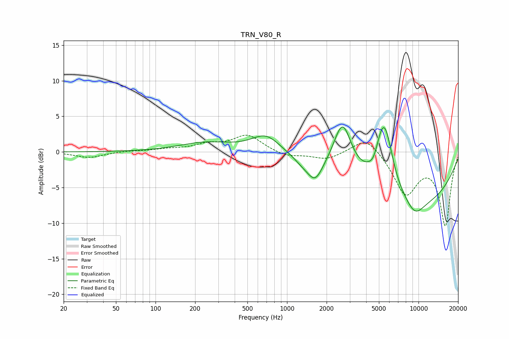

# TRN_V80_R
See [usage instructions](https://github.com/jaakkopasanen/AutoEq#usage) for more options and info.

### Parametric EQs
Apply preamp of -3.6 dB when using parametric equalizer.

|   # | Type    |   Fc (Hz) |    Q |   Gain (dB) |
|-----|---------|-----------|------|-------------|
|   1 | Peaking |       242 | 0.7  |         1.3 |
|   2 | Peaking |       693 | 1.29 |         2.5 |
|   3 | Peaking |      1319 | 2.09 |        -0.7 |
|   4 | Peaking |      1639 | 2.4  |        -3   |
|   5 | Peaking |      2646 | 2    |         7.4 |
|   6 | Peaking |      4561 | 4.06 |        -1.1 |
|   7 | Peaking |      5432 | 2.11 |         6.4 |
|   8 | Peaking |      5515 | 2.2  |         3.8 |
|   9 | Peaking |      8386 | 0.27 |        -7.5 |
|  10 | Peaking |      9398 | 1.82 |        -2   |

### Fixed Band EQs
When using fixed band (also called graphic) equalizer, apply preamp of **-2.4 dB** (if available) and set gains manually with these parameters.

|   # | Type    |   Fc (Hz) |    Q |   Gain (dB) |
|-----|---------|-----------|------|-------------|
|   1 | Peaking |        31 | 1.41 |        -0.8 |
|   2 | Peaking |        62 | 1.41 |         0.1 |
|   3 | Peaking |       125 | 1.41 |         0.3 |
|   4 | Peaking |       250 | 1.41 |         0.9 |
|   5 | Peaking |       500 | 1.41 |         2.3 |
|   6 | Peaking |      1000 | 1.41 |        -0.7 |
|   7 | Peaking |      2000 | 1.41 |        -1   |
|   8 | Peaking |      4000 | 1.41 |         2.4 |
|   9 | Peaking |      8000 | 1.41 |        -5.8 |
|  10 | Peaking |     16000 | 1.41 |       -10.2 |

### Graphs

