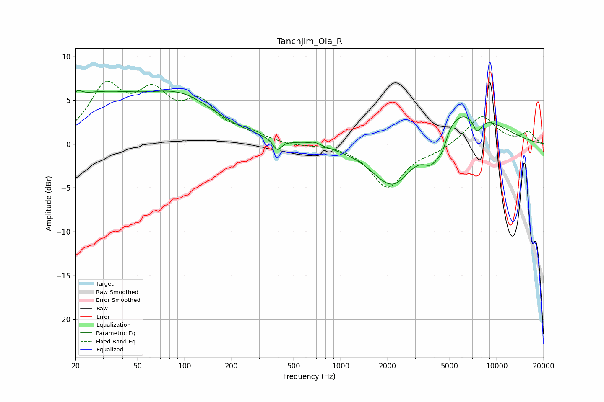

# Tanchjim_Ola_R
See [usage instructions](https://github.com/jaakkopasanen/AutoEq#usage) for more options and info.

### Parametric EQs
Apply preamp of -6.2 dB when using parametric equalizer.

|   # | Type    |   Fc (Hz) |    Q |   Gain (dB) |
|-----|---------|-----------|------|-------------|
|   1 | Peaking |        21 | 5.09 |         0.7 |
|   2 | Peaking |        26 | 0.45 |         5.1 |
|   3 | Peaking |        97 | 0.62 |         4.3 |
|   4 | Peaking |       393 | 5.35 |        -1.3 |
|   5 | Peaking |       681 | 3.99 |         0.4 |
|   6 | Peaking |      2190 | 1    |        -6.2 |
|   7 | Peaking |      3863 | 2.25 |        -3.7 |
|   8 | Peaking |      4489 | 4.59 |        -1.5 |
|   9 | Peaking |      5407 | 0.56 |         5.1 |
|  10 | Peaking |      7525 | 4.2  |        -2   |

### Fixed Band EQs
When using fixed band (also called graphic) equalizer, apply preamp of **-7.3 dB** (if available) and set gains manually with these parameters.

|   # | Type    |   Fc (Hz) |    Q |   Gain (dB) |
|-----|---------|-----------|------|-------------|
|   1 | Peaking |        31 | 1.41 |         6.1 |
|   2 | Peaking |        62 | 1.41 |         4.9 |
|   3 | Peaking |       125 | 1.41 |         4.1 |
|   4 | Peaking |       250 | 1.41 |         1   |
|   5 | Peaking |       500 | 1.41 |        -0.2 |
|   6 | Peaking |      1000 | 1.41 |         0   |
|   7 | Peaking |      2000 | 1.41 |        -4.9 |
|   8 | Peaking |      4000 | 1.41 |        -0.7 |
|   9 | Peaking |      8000 | 1.41 |         3.3 |
|  10 | Peaking |     16000 | 1.41 |         1.3 |

### Graphs

