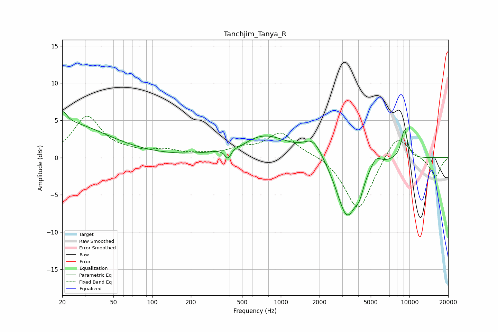

# Tanchjim_Tanya_R
See [usage instructions](https://github.com/jaakkopasanen/AutoEq#usage) for more options and info.

### Parametric EQs
Apply preamp of -6.2 dB when using parametric equalizer.

|   # | Type    |   Fc (Hz) |    Q |   Gain (dB) |
|-----|---------|-----------|------|-------------|
|   1 | Peaking |        20 | 0.42 |         4.7 |
|   2 | Peaking |        20 | 4.84 |         1.5 |
|   3 | Peaking |       388 | 5.99 |        -1.4 |
|   4 | Peaking |       499 | 2.67 |        -0.3 |
|   5 | Peaking |       750 | 0.76 |         2.9 |
|   6 | Peaking |      1796 | 1.89 |         2.5 |
|   7 | Peaking |      3266 | 1.71 |        -8.2 |
|   8 | Peaking |      4079 | 4.73 |        -1.6 |
|   9 | Peaking |      5472 | 3.41 |         1.4 |
|  10 | Peaking |      9127 | 4.98 |         3.9 |

### Fixed Band EQs
When using fixed band (also called graphic) equalizer, apply preamp of **-5.6 dB** (if available) and set gains manually with these parameters.

|   # | Type    |   Fc (Hz) |    Q |   Gain (dB) |
|-----|---------|-----------|------|-------------|
|   1 | Peaking |        31 | 1.41 |         5.4 |
|   2 | Peaking |        62 | 1.41 |         0.5 |
|   3 | Peaking |       125 | 1.41 |         0.8 |
|   4 | Peaking |       250 | 1.41 |         0.3 |
|   5 | Peaking |       500 | 1.41 |         1   |
|   6 | Peaking |      1000 | 1.41 |         3.3 |
|   7 | Peaking |      2000 | 1.41 |         0.4 |
|   8 | Peaking |      4000 | 1.41 |        -7.3 |
|   9 | Peaking |      8000 | 1.41 |         3.4 |
|  10 | Peaking |     16000 | 1.41 |        -2.6 |

### Graphs

