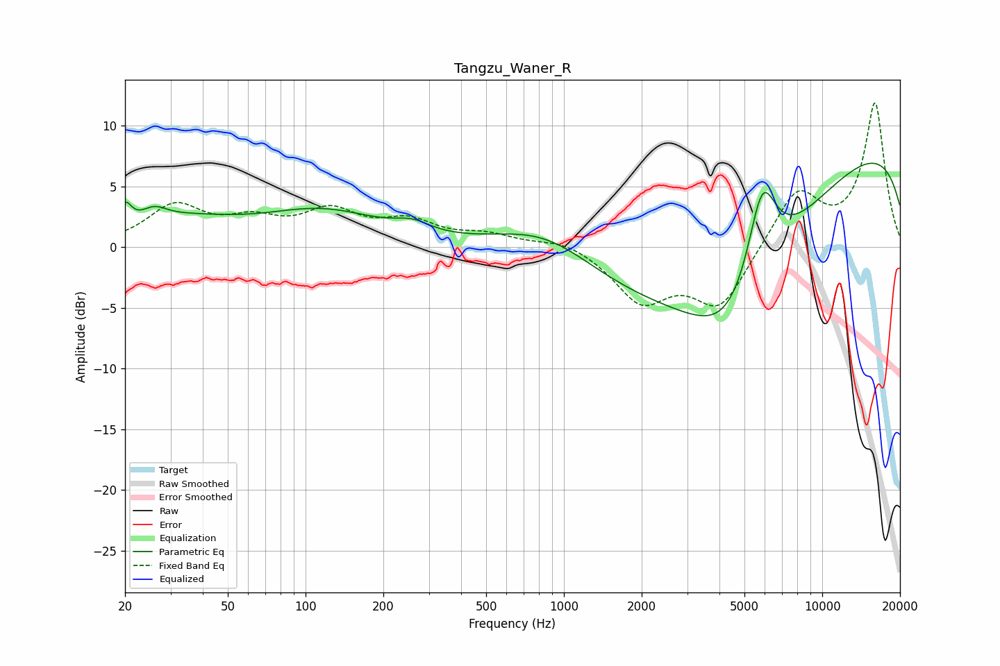

# Tangzu_Waner_R
See [usage instructions](https://github.com/jaakkopasanen/AutoEq#usage) for more options and info.

### Parametric EQs
Apply preamp of -7.0 dB when using parametric equalizer.

|   # | Type    |   Fc (Hz) |    Q |   Gain (dB) |
|-----|---------|-----------|------|-------------|
|   1 | Peaking |        20 | 6    |         1.8 |
|   2 | Peaking |        26 | 2.89 |         1.1 |
|   3 | Peaking |        33 | 0.65 |         1.9 |
|   4 | Peaking |       117 | 0.61 |         2.7 |
|   5 | Peaking |       260 | 2.07 |         0.8 |
|   6 | Peaking |       863 | 0.65 |         4.1 |
|   7 | Peaking |      4146 | 0.21 |       -10   |
|   8 | Peaking |      4584 | 0.78 |        -7.6 |
|   9 | Peaking |      5842 | 2.27 |         8.6 |
|  10 | Peaking |      9971 | 0.21 |        13   |

### Fixed Band EQs
When using fixed band (also called graphic) equalizer, apply preamp of **-12.0 dB** (if available) and set gains manually with these parameters.

|   # | Type    |   Fc (Hz) |    Q |   Gain (dB) |
|-----|---------|-----------|------|-------------|
|   1 | Peaking |        31 | 1.41 |         3.2 |
|   2 | Peaking |        62 | 1.41 |         1.8 |
|   3 | Peaking |       125 | 1.41 |         2.6 |
|   4 | Peaking |       250 | 1.41 |         1.8 |
|   5 | Peaking |       500 | 1.41 |         0.9 |
|   6 | Peaking |      1000 | 1.41 |         0.7 |
|   7 | Peaking |      2000 | 1.41 |        -4.3 |
|   8 | Peaking |      4000 | 1.41 |        -4.9 |
|   9 | Peaking |      8000 | 1.41 |         4.6 |
|  10 | Peaking |     16000 | 1.41 |        11.8 |

### Graphs

