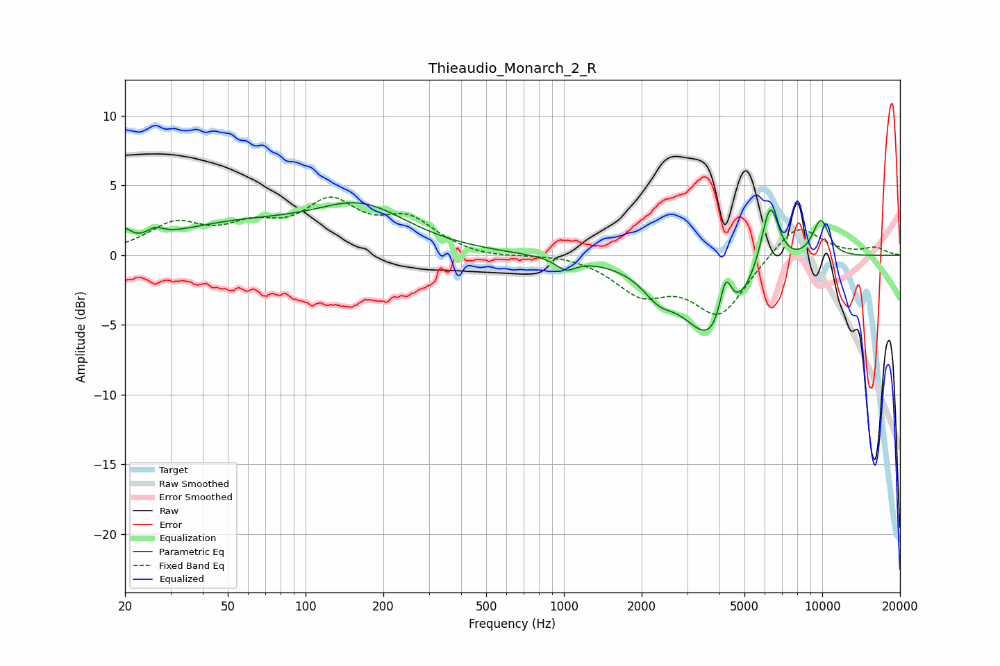

# Thieaudio_Monarch_2_R
See [usage instructions](https://github.com/jaakkopasanen/AutoEq#usage) for more options and info.

### Parametric EQs
Apply preamp of -3.9 dB when using parametric equalizer.

|   # | Type    |   Fc (Hz) |    Q |   Gain (dB) |
|-----|---------|-----------|------|-------------|
|   1 | Peaking |        20 | 5.92 |         0.9 |
|   2 | Peaking |        26 | 4.57 |         0.6 |
|   3 | Peaking |        54 | 0.5  |         2   |
|   4 | Peaking |       165 | 0.78 |         3   |
|   5 | Peaking |      1017 | 3.71 |        -0.8 |
|   6 | Peaking |      2322 | 2.35 |        -1.4 |
|   7 | Peaking |      3791 | 1.22 |        -6.1 |
|   8 | Peaking |      4228 | 5.7  |         3.4 |
|   9 | Peaking |      6280 | 3.79 |         5.1 |
|  10 | Peaking |      9867 | 3.59 |         2.8 |

### Fixed Band EQs
When using fixed band (also called graphic) equalizer, apply preamp of **-4.3 dB** (if available) and set gains manually with these parameters.

|   # | Type    |   Fc (Hz) |    Q |   Gain (dB) |
|-----|---------|-----------|------|-------------|
|   1 | Peaking |        31 | 1.41 |         2   |
|   2 | Peaking |        62 | 1.41 |         1.6 |
|   3 | Peaking |       125 | 1.41 |         3.4 |
|   4 | Peaking |       250 | 1.41 |         2.3 |
|   5 | Peaking |       500 | 1.41 |        -0.3 |
|   6 | Peaking |      1000 | 1.41 |         0.2 |
|   7 | Peaking |      2000 | 1.41 |        -2.5 |
|   8 | Peaking |      4000 | 1.41 |        -4.1 |
|   9 | Peaking |      8000 | 1.41 |         2.4 |
|  10 | Peaking |     16000 | 1.41 |         0.5 |

### Graphs

