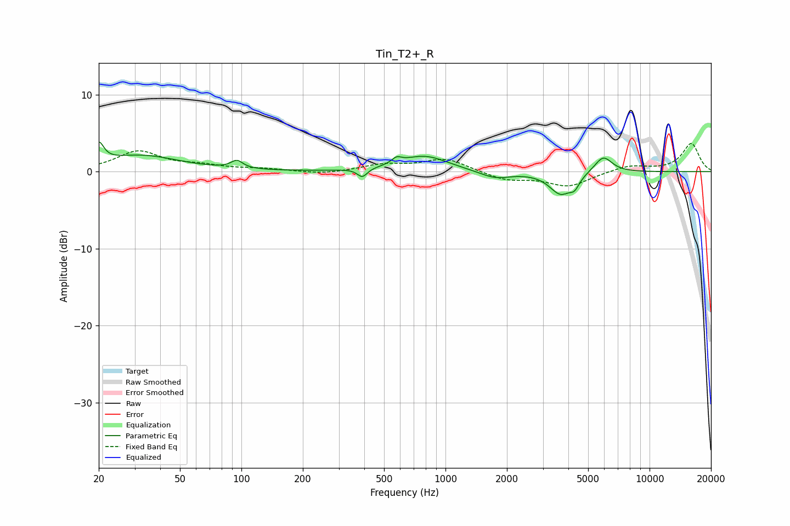

# Tin_T2+_R
See [usage instructions](https://github.com/jaakkopasanen/AutoEq#usage) for more options and info.

### Parametric EQs
Apply preamp of -4.0 dB when using parametric equalizer.

|   # | Type    |   Fc (Hz) |    Q |   Gain (dB) |
|-----|---------|-----------|------|-------------|
|   1 | Peaking |        20 | 5.93 |         2.5 |
|   2 | Peaking |        32 | 0.75 |         2.1 |
|   3 | Peaking |        95 | 5    |         1   |
|   4 | Peaking |       391 | 6    |        -1.1 |
|   5 | Peaking |       576 | 6    |         0.7 |
|   6 | Peaking |       787 | 1.23 |         2   |
|   7 | Peaking |      1750 | 1.86 |        -1   |
|   8 | Peaking |      3670 | 2.55 |        -2.9 |
|   9 | Peaking |      4294 | 6    |        -1.2 |
|  10 | Peaking |      5933 | 3.18 |         2.1 |

### Fixed Band EQs
When using fixed band (also called graphic) equalizer, apply preamp of **-3.8 dB** (if available) and set gains manually with these parameters.

|   # | Type    |   Fc (Hz) |    Q |   Gain (dB) |
|-----|---------|-----------|------|-------------|
|   1 | Peaking |        31 | 1.41 |         2.6 |
|   2 | Peaking |        62 | 1.41 |         0.6 |
|   3 | Peaking |       125 | 1.41 |         0.3 |
|   4 | Peaking |       250 | 1.41 |        -0.4 |
|   5 | Peaking |       500 | 1.41 |         0.9 |
|   6 | Peaking |      1000 | 1.41 |         1.7 |
|   7 | Peaking |      2000 | 1.41 |        -1.1 |
|   8 | Peaking |      4000 | 1.41 |        -1.9 |
|   9 | Peaking |      8000 | 1.41 |         0.8 |
|  10 | Peaking |     16000 | 1.41 |         3.7 |

### Graphs

