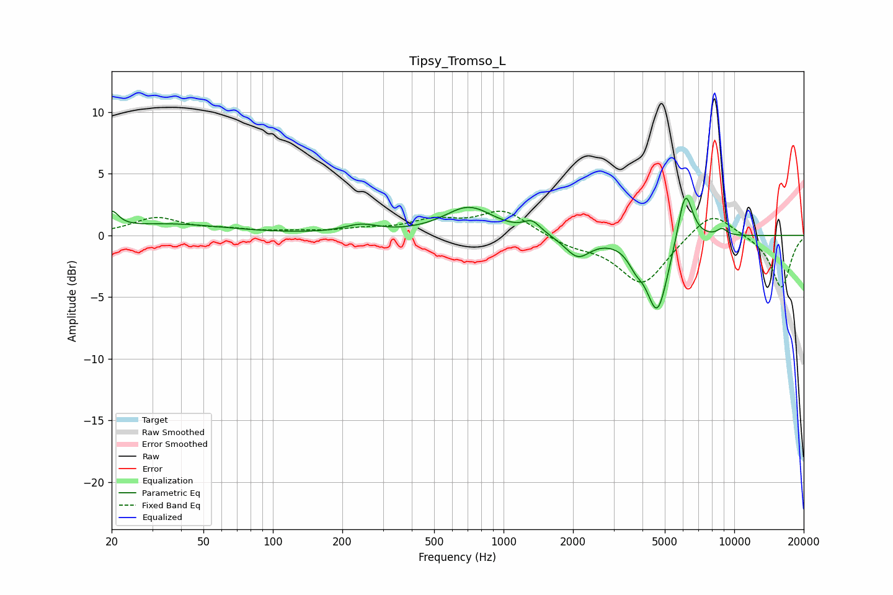

# Tipsy_Tromso_L
See [usage instructions](https://github.com/jaakkopasanen/AutoEq#usage) for more options and info.

### Parametric EQs
Apply preamp of -3.1 dB when using parametric equalizer.

|   # | Type    |   Fc (Hz) |    Q |   Gain (dB) |
|-----|---------|-----------|------|-------------|
|   1 | Peaking |        20 | 4.84 |         1.4 |
|   2 | Peaking |        35 | 0.56 |         0.9 |
|   3 | Peaking |       241 | 1.9  |         0.7 |
|   4 | Peaking |       708 | 1.32 |         2.2 |
|   5 | Peaking |      1330 | 3.77 |         0.9 |
|   6 | Peaking |      2095 | 2.56 |        -1.7 |
|   7 | Peaking |      3735 | 4.21 |        -1.1 |
|   8 | Peaking |      4641 | 2.91 |        -6.2 |
|   9 | Peaking |      6128 | 4.27 |         4.5 |
|  10 | Peaking |      8856 | 5.78 |         0.6 |

### Fixed Band EQs
When using fixed band (also called graphic) equalizer, apply preamp of **-2.1 dB** (if available) and set gains manually with these parameters.

|   # | Type    |   Fc (Hz) |    Q |   Gain (dB) |
|-----|---------|-----------|------|-------------|
|   1 | Peaking |        31 | 1.41 |         1.4 |
|   2 | Peaking |        62 | 1.41 |         0.4 |
|   3 | Peaking |       125 | 1.41 |         0.2 |
|   4 | Peaking |       250 | 1.41 |         0.4 |
|   5 | Peaking |       500 | 1.41 |         1.1 |
|   6 | Peaking |      1000 | 1.41 |         2   |
|   7 | Peaking |      2000 | 1.41 |        -0.8 |
|   8 | Peaking |      4000 | 1.41 |        -4   |
|   9 | Peaking |      8000 | 1.41 |         2.2 |
|  10 | Peaking |     16000 | 1.41 |        -4.3 |

### Graphs

