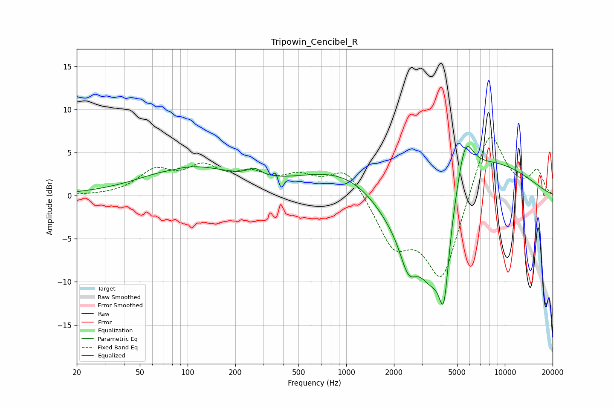

# Tripowin_Cencibel_R
See [usage instructions](https://github.com/jaakkopasanen/AutoEq#usage) for more options and info.

### Parametric EQs
Apply preamp of -5.8 dB when using parametric equalizer.

|   # | Type    |   Fc (Hz) |    Q |   Gain (dB) |
|-----|---------|-----------|------|-------------|
|   1 | Peaking |        80 | 2.89 |        -0.1 |
|   2 | Peaking |       104 | 0.49 |         3.2 |
|   3 | Peaking |       263 | 3.29 |         0.9 |
|   4 | Peaking |      1815 | 0.35 |         4.1 |
|   5 | Peaking |      1996 | 0.62 |        -9   |
|   6 | Peaking |      2466 | 2.55 |        -4.4 |
|   7 | Peaking |      3460 | 0.93 |       -16.8 |
|   8 | Peaking |      3473 | 0.32 |        11.6 |
|   9 | Peaking |      4129 | 4.35 |        -8.7 |
|  10 | Peaking |      5618 | 2.71 |         5.4 |

### Fixed Band EQs
When using fixed band (also called graphic) equalizer, apply preamp of **-6.9 dB** (if available) and set gains manually with these parameters.

|   # | Type    |   Fc (Hz) |    Q |   Gain (dB) |
|-----|---------|-----------|------|-------------|
|   1 | Peaking |        31 | 1.41 |        -0   |
|   2 | Peaking |        62 | 1.41 |         2.6 |
|   3 | Peaking |       125 | 1.41 |         2.9 |
|   4 | Peaking |       250 | 1.41 |         2.1 |
|   5 | Peaking |       500 | 1.41 |         1.9 |
|   6 | Peaking |      1000 | 1.41 |         3.3 |
|   7 | Peaking |      2000 | 1.41 |        -5.4 |
|   8 | Peaking |      4000 | 1.41 |        -9.8 |
|   9 | Peaking |      8000 | 1.41 |         8.3 |
|  10 | Peaking |     16000 | 1.41 |         2.7 |

### Graphs

