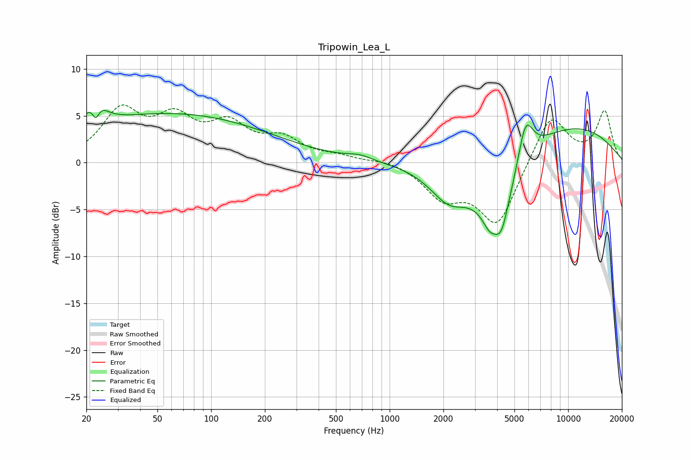

# Tripowin_Lea_L
See [usage instructions](https://github.com/jaakkopasanen/AutoEq#usage) for more options and info.

### Parametric EQs
Apply preamp of -5.7 dB when using parametric equalizer.

|   # | Type    |   Fc (Hz) |    Q |   Gain (dB) |
|-----|---------|-----------|------|-------------|
|   1 | Peaking |        22 | 3.26 |         4.2 |
|   2 | Peaking |        23 | 5.84 |        -3.3 |
|   3 | Peaking |        60 | 0.25 |         5.2 |
|   4 | Peaking |       679 | 2.07 |         0.5 |
|   5 | Peaking |      2152 | 1.27 |        -3.7 |
|   6 | Peaking |      3625 | 4.05 |        -1.1 |
|   7 | Peaking |      4051 | 1.24 |        -7.9 |
|   8 | Peaking |      4226 | 4.35 |        -1.8 |
|   9 | Peaking |      5765 | 3.15 |         4.8 |
|  10 | Peaking |      9350 | 0.35 |         4.2 |

### Fixed Band EQs
When using fixed band (also called graphic) equalizer, apply preamp of **-6.2 dB** (if available) and set gains manually with these parameters.

|   # | Type    |   Fc (Hz) |    Q |   Gain (dB) |
|-----|---------|-----------|------|-------------|
|   1 | Peaking |        31 | 1.41 |         5.2 |
|   2 | Peaking |        62 | 1.41 |         4   |
|   3 | Peaking |       125 | 1.41 |         3.5 |
|   4 | Peaking |       250 | 1.41 |         2.2 |
|   5 | Peaking |       500 | 1.41 |         0.5 |
|   6 | Peaking |      1000 | 1.41 |         0.4 |
|   7 | Peaking |      2000 | 1.41 |        -3.4 |
|   8 | Peaking |      4000 | 1.41 |        -6.6 |
|   9 | Peaking |      8000 | 1.41 |         5.3 |
|  10 | Peaking |     16000 | 1.41 |         5.4 |

### Graphs

