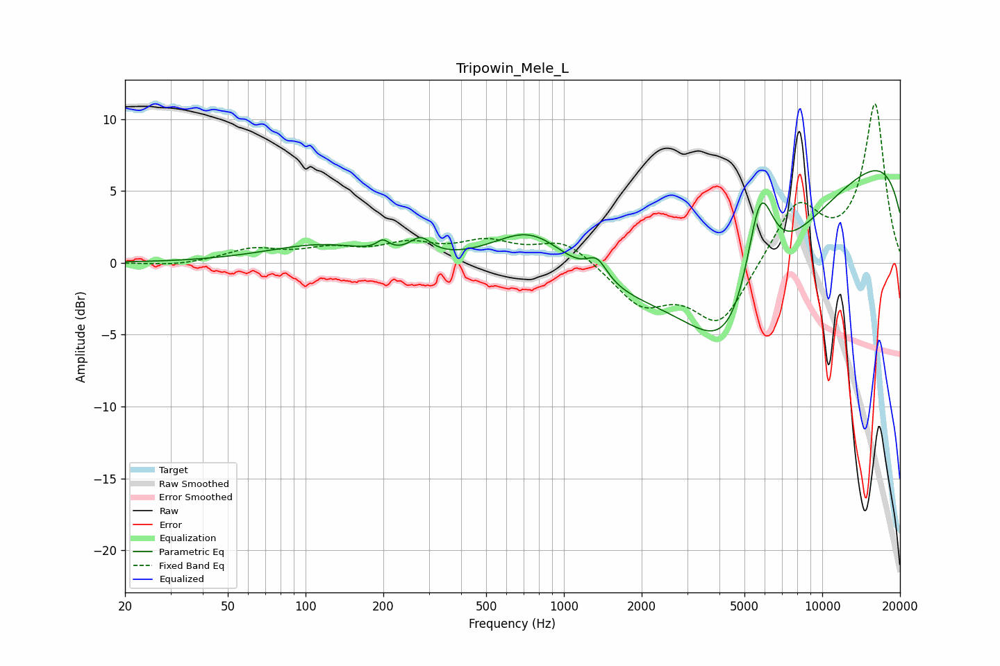

# Tripowin_Mele_L
See [usage instructions](https://github.com/jaakkopasanen/AutoEq#usage) for more options and info.

### Parametric EQs
Apply preamp of -6.5 dB when using parametric equalizer.

|   # | Type    |   Fc (Hz) |    Q |   Gain (dB) |
|-----|---------|-----------|------|-------------|
|   1 | Peaking |        62 | 1.41 |         0   |
|   2 | Peaking |       114 | 0.71 |         1.2 |
|   3 | Peaking |       199 | 5.98 |         0.7 |
|   4 | Peaking |       279 | 3.43 |         1.2 |
|   5 | Peaking |       755 | 0.88 |         4   |
|   6 | Peaking |      1343 | 3.52 |         1.5 |
|   7 | Peaking |      4225 | 0.18 |        -6.6 |
|   8 | Peaking |      4542 | 0.75 |        -9.3 |
|   9 | Peaking |      5744 | 2.43 |         8   |
|  10 | Peaking |      9854 | 0.18 |        11.2 |

### Fixed Band EQs
When using fixed band (also called graphic) equalizer, apply preamp of **-11.1 dB** (if available) and set gains manually with these parameters.

|   # | Type    |   Fc (Hz) |    Q |   Gain (dB) |
|-----|---------|-----------|------|-------------|
|   1 | Peaking |        31 | 1.41 |        -0.2 |
|   2 | Peaking |        62 | 1.41 |         0.9 |
|   3 | Peaking |       125 | 1.41 |         0.8 |
|   4 | Peaking |       250 | 1.41 |         1.1 |
|   5 | Peaking |       500 | 1.41 |         1.3 |
|   6 | Peaking |      1000 | 1.41 |         1.6 |
|   7 | Peaking |      2000 | 1.41 |        -2.8 |
|   8 | Peaking |      4000 | 1.41 |        -4.3 |
|   9 | Peaking |      8000 | 1.41 |         4.1 |
|  10 | Peaking |     16000 | 1.41 |        11   |

### Graphs

