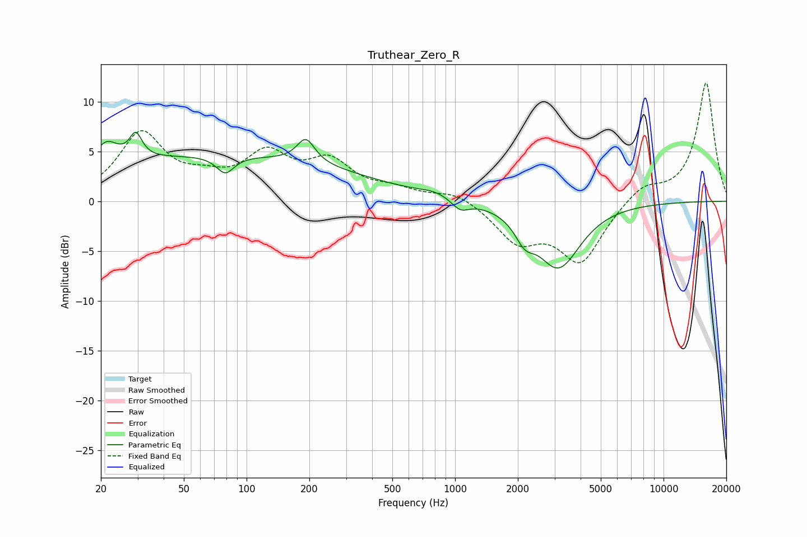

# Truthear_Zero_R
See [usage instructions](https://github.com/jaakkopasanen/AutoEq#usage) for more options and info.

### Parametric EQs
Apply preamp of -7.0 dB when using parametric equalizer.

|   # | Type    |   Fc (Hz) |    Q |   Gain (dB) |
|-----|---------|-----------|------|-------------|
|   1 | Peaking |        21 | 2.53 |         2.4 |
|   2 | Peaking |        29 | 4.87 |         2.4 |
|   3 | Peaking |        73 | 0.19 |         4.5 |
|   4 | Peaking |        79 | 3.4  |        -1.8 |
|   5 | Peaking |       193 | 3.32 |         2.4 |
|   6 | Peaking |       801 | 1.88 |         0.5 |
|   7 | Peaking |      1059 | 3.4  |        -1.1 |
|   8 | Peaking |      2156 | 3.11 |        -2   |
|   9 | Peaking |      3144 | 1.39 |        -6.8 |
|  10 | Peaking |      3217 | 2.51 |         0.3 |

### Fixed Band EQs
When using fixed band (also called graphic) equalizer, apply preamp of **-12.0 dB** (if available) and set gains manually with these parameters.

|   # | Type    |   Fc (Hz) |    Q |   Gain (dB) |
|-----|---------|-----------|------|-------------|
|   1 | Peaking |        31 | 1.41 |         6.6 |
|   2 | Peaking |        62 | 1.41 |         1.4 |
|   3 | Peaking |       125 | 1.41 |         4.2 |
|   4 | Peaking |       250 | 1.41 |         3.5 |
|   5 | Peaking |       500 | 1.41 |         1   |
|   6 | Peaking |      1000 | 1.41 |         1   |
|   7 | Peaking |      2000 | 1.41 |        -3.7 |
|   8 | Peaking |      4000 | 1.41 |        -5.9 |
|   9 | Peaking |      8000 | 1.41 |         1.6 |
|  10 | Peaking |     16000 | 1.41 |        11.9 |

### Graphs

