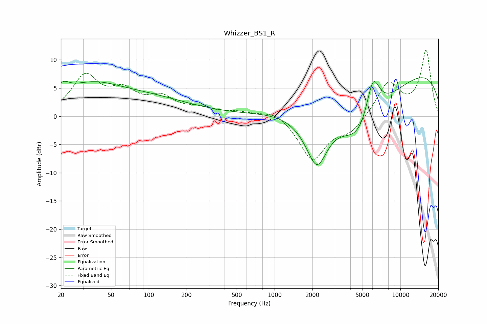

# Whizzer_BS1_R
See [usage instructions](https://github.com/jaakkopasanen/AutoEq#usage) for more options and info.

### Parametric EQs
Apply preamp of -6.9 dB when using parametric equalizer.

|   # | Type    |   Fc (Hz) |    Q |   Gain (dB) |
|-----|---------|-----------|------|-------------|
|   1 | Peaking |        21 | 4.36 |         2.8 |
|   2 | Peaking |        21 | 5.09 |        -1.6 |
|   3 | Peaking |        37 | 0.81 |         1.6 |
|   4 | Peaking |        41 | 0.2  |         4.5 |
|   5 | Peaking |       218 | 5.97 |        -0   |
|   6 | Peaking |      2172 | 1.14 |       -14.8 |
|   7 | Peaking |      2482 | 0.57 |         7.2 |
|   8 | Peaking |      4740 | 0.63 |       -13.8 |
|   9 | Peaking |      6043 | 2.39 |         8.1 |
|  10 | Peaking |      9401 | 0.18 |         9.4 |

### Fixed Band EQs
When using fixed band (also called graphic) equalizer, apply preamp of **-11.8 dB** (if available) and set gains manually with these parameters.

|   # | Type    |   Fc (Hz) |    Q |   Gain (dB) |
|-----|---------|-----------|------|-------------|
|   1 | Peaking |        31 | 1.41 |         6.8 |
|   2 | Peaking |        62 | 1.41 |         3.7 |
|   3 | Peaking |       125 | 1.41 |         2.9 |
|   4 | Peaking |       250 | 1.41 |         1.1 |
|   5 | Peaking |       500 | 1.41 |         0.7 |
|   6 | Peaking |      1000 | 1.41 |         1.3 |
|   7 | Peaking |      2000 | 1.41 |        -7.7 |
|   8 | Peaking |      4000 | 1.41 |        -2.5 |
|   9 | Peaking |      8000 | 1.41 |         5.9 |
|  10 | Peaking |     16000 | 1.41 |        11.5 |

### Graphs

