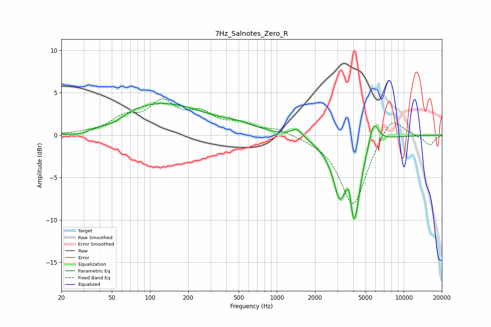

# 7Hz_Salnotes_Zero_R
See [usage instructions](https://github.com/jaakkopasanen/AutoEq#usage) for more options and info.

### Parametric EQs
Apply preamp of -3.8 dB when using parametric equalizer.

|   # | Type    |   Fc (Hz) |    Q |   Gain (dB) |
|-----|---------|-----------|------|-------------|
|   1 | Peaking |        29 | 1.13 |        -0.8 |
|   2 | Peaking |        52 | 1.81 |        -0.7 |
|   3 | Peaking |       119 | 0.38 |         3.8 |
|   4 | Peaking |       518 | 1.13 |         0.6 |
|   5 | Peaking |      1441 | 3.61 |         1   |
|   6 | Peaking |      2688 | 1.55 |        -1.4 |
|   7 | Peaking |      3099 | 3.62 |        -3.9 |
|   8 | Peaking |      3725 | 5.93 |         3.2 |
|   9 | Peaking |      4030 | 2.91 |       -10.5 |
|  10 | Peaking |      5787 | 3.53 |         3   |

### Fixed Band EQs
When using fixed band (also called graphic) equalizer, apply preamp of **-4.4 dB** (if available) and set gains manually with these parameters.

|   # | Type    |   Fc (Hz) |    Q |   Gain (dB) |
|-----|---------|-----------|------|-------------|
|   1 | Peaking |        31 | 1.41 |         0.2 |
|   2 | Peaking |        62 | 1.41 |         1.8 |
|   3 | Peaking |       125 | 1.41 |         3.5 |
|   4 | Peaking |       250 | 1.41 |         2.2 |
|   5 | Peaking |       500 | 1.41 |         1.1 |
|   6 | Peaking |      1000 | 1.41 |         0.7 |
|   7 | Peaking |      2000 | 1.41 |        -0.2 |
|   8 | Peaking |      4000 | 1.41 |        -8.4 |
|   9 | Peaking |      8000 | 1.41 |         2.7 |
|  10 | Peaking |     16000 | 1.41 |        -1.2 |

### Graphs

