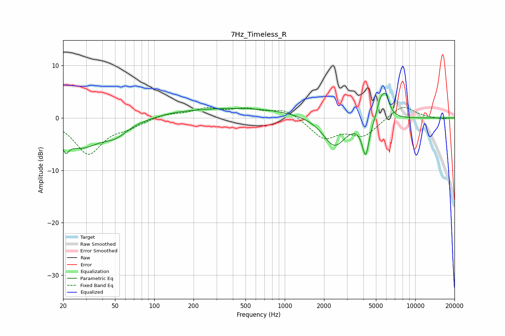

# 7Hz_Timeless_R
See [usage instructions](https://github.com/jaakkopasanen/AutoEq#usage) for more options and info.

### Parametric EQs
Apply preamp of -4.8 dB when using parametric equalizer.

|   # | Type    |   Fc (Hz) |    Q |   Gain (dB) |
|-----|---------|-----------|------|-------------|
|   1 | Peaking |        21 | 5.92 |         3.3 |
|   2 | Peaking |        21 | 5.86 |        -5.7 |
|   3 | Peaking |        27 | 0.93 |        -5.2 |
|   4 | Peaking |        51 | 1.49 |        -2.1 |
|   5 | Peaking |       145 | 1.07 |         0.3 |
|   6 | Peaking |       447 | 0.3  |         1.9 |
|   7 | Peaking |      2400 | 1.6  |        -5.7 |
|   8 | Peaking |      4165 | 5.18 |        -6.6 |
|   9 | Peaking |      5356 | 5.84 |         2.3 |
|  10 | Peaking |      5884 | 4.28 |         4.5 |

### Fixed Band EQs
When using fixed band (also called graphic) equalizer, apply preamp of **-2.1 dB** (if available) and set gains manually with these parameters.

|   # | Type    |   Fc (Hz) |    Q |   Gain (dB) |
|-----|---------|-----------|------|-------------|
|   1 | Peaking |        31 | 1.41 |        -6.7 |
|   2 | Peaking |        62 | 1.41 |        -1.3 |
|   3 | Peaking |       125 | 1.41 |         0.8 |
|   4 | Peaking |       250 | 1.41 |         1.6 |
|   5 | Peaking |       500 | 1.41 |         1.5 |
|   6 | Peaking |      1000 | 1.41 |         1.7 |
|   7 | Peaking |      2000 | 1.41 |        -3.8 |
|   8 | Peaking |      4000 | 1.41 |        -3.3 |
|   9 | Peaking |      8000 | 1.41 |         2.5 |
|  10 | Peaking |     16000 | 1.41 |        -0.3 |

### Graphs

