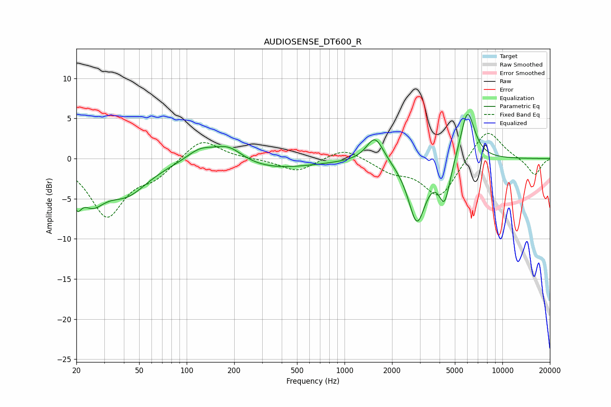

# AUDIOSENSE_DT600_R
See [usage instructions](https://github.com/jaakkopasanen/AutoEq#usage) for more options and info.

### Parametric EQs
Apply preamp of -5.6 dB when using parametric equalizer.

|   # | Type    |   Fc (Hz) |    Q |   Gain (dB) |
|-----|---------|-----------|------|-------------|
|   1 | Peaking |        20 | 5.36 |        -2.9 |
|   2 | Peaking |        25 | 1.77 |        -4   |
|   3 | Peaking |        42 | 1.03 |        -3.9 |
|   4 | Peaking |       121 | 1.59 |         1.6 |
|   5 | Peaking |       183 | 1.43 |         2.2 |
|   6 | Peaking |       304 | 0.46 |        -1.4 |
|   7 | Peaking |      1560 | 2.61 |         3.2 |
|   8 | Peaking |      2876 | 2.52 |        -7.8 |
|   9 | Peaking |      4304 | 3.86 |        -5   |
|  10 | Peaking |      6010 | 3.02 |         6.5 |

### Fixed Band EQs
When using fixed band (also called graphic) equalizer, apply preamp of **-3.2 dB** (if available) and set gains manually with these parameters.

|   # | Type    |   Fc (Hz) |    Q |   Gain (dB) |
|-----|---------|-----------|------|-------------|
|   1 | Peaking |        31 | 1.41 |        -7   |
|   2 | Peaking |        62 | 1.41 |        -1.9 |
|   3 | Peaking |       125 | 1.41 |         2.6 |
|   4 | Peaking |       250 | 1.41 |        -0   |
|   5 | Peaking |       500 | 1.41 |        -1.6 |
|   6 | Peaking |      1000 | 1.41 |         1.5 |
|   7 | Peaking |      2000 | 1.41 |        -1.4 |
|   8 | Peaking |      4000 | 1.41 |        -4.9 |
|   9 | Peaking |      8000 | 1.41 |         4   |
|  10 | Peaking |     16000 | 1.41 |        -2.1 |

### Graphs

