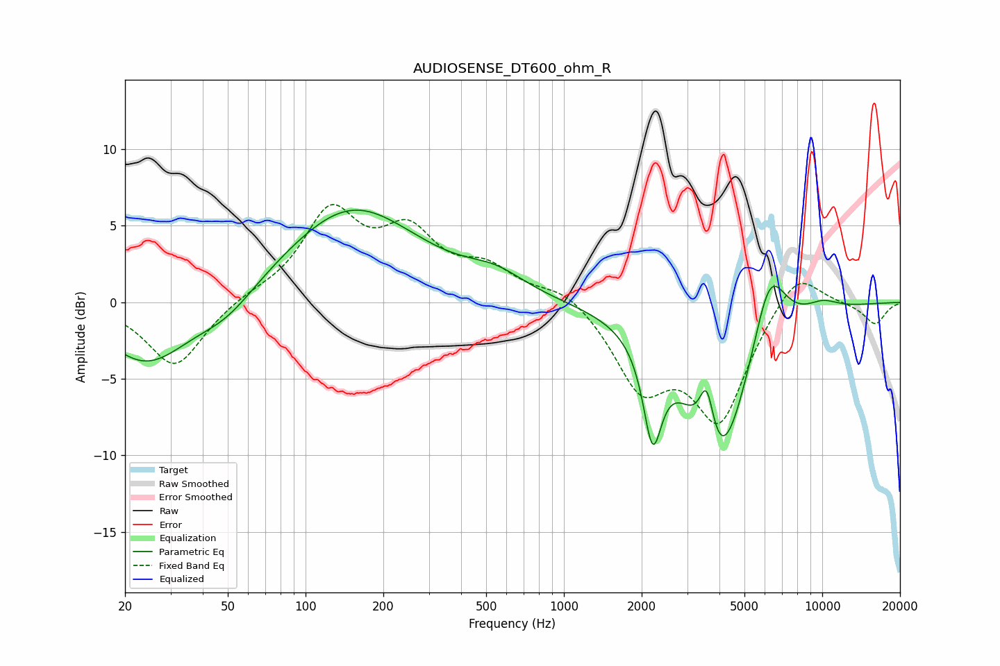

# AUDIOSENSE_DT600_ohm_R
See [usage instructions](https://github.com/jaakkopasanen/AutoEq#usage) for more options and info.

### Parametric EQs
Apply preamp of -6.1 dB when using parametric equalizer.

|   # | Type    |   Fc (Hz) |    Q |   Gain (dB) |
|-----|---------|-----------|------|-------------|
|   1 | Peaking |        23 | 3.12 |        -0   |
|   2 | Peaking |        25 | 0.86 |        -4   |
|   3 | Peaking |        50 | 1.24 |        -1.4 |
|   4 | Peaking |       151 | 0.55 |         6.2 |
|   5 | Peaking |       544 | 1.23 |         1.2 |
|   6 | Peaking |      2205 | 3.97 |        -6.1 |
|   7 | Peaking |      3571 | 4.87 |         4   |
|   8 | Peaking |      3986 | 1.15 |       -11.1 |
|   9 | Peaking |      6242 | 2.07 |         5.4 |
|  10 | Peaking |     10000 | 1.87 |         0.7 |

### Fixed Band EQs
When using fixed band (also called graphic) equalizer, apply preamp of **-6.5 dB** (if available) and set gains manually with these parameters.

|   # | Type    |   Fc (Hz) |    Q |   Gain (dB) |
|-----|---------|-----------|------|-------------|
|   1 | Peaking |        31 | 1.41 |        -4.3 |
|   2 | Peaking |        62 | 1.41 |         0.4 |
|   3 | Peaking |       125 | 1.41 |         5.6 |
|   4 | Peaking |       250 | 1.41 |         4   |
|   5 | Peaking |       500 | 1.41 |         1.9 |
|   6 | Peaking |      1000 | 1.41 |         1.1 |
|   7 | Peaking |      2000 | 1.41 |        -5.1 |
|   8 | Peaking |      4000 | 1.41 |        -7.4 |
|   9 | Peaking |      8000 | 1.41 |         2.5 |
|  10 | Peaking |     16000 | 1.41 |        -1.4 |

### Graphs

