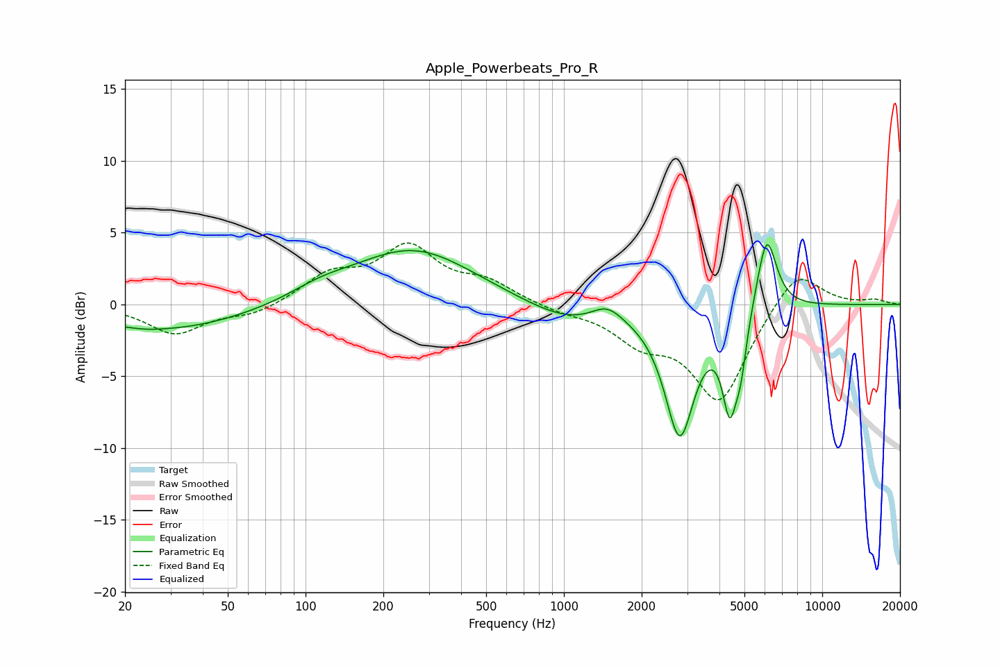

# Apple_Powerbeats_Pro_R
See [usage instructions](https://github.com/jaakkopasanen/AutoEq#usage) for more options and info.

### Parametric EQs
Apply preamp of -4.3 dB when using parametric equalizer.

|   # | Type    |   Fc (Hz) |    Q |   Gain (dB) |
|-----|---------|-----------|------|-------------|
|   1 | Peaking |        24 | 2.31 |        -0.1 |
|   2 | Peaking |        29 | 0.45 |        -1.8 |
|   3 | Peaking |       114 | 1.2  |         0.7 |
|   4 | Peaking |       260 | 0.6  |         3.9 |
|   5 | Peaking |      1048 | 0.84 |        -1.4 |
|   6 | Peaking |      1468 | 2.32 |         1.1 |
|   7 | Peaking |      2808 | 2.42 |        -8.9 |
|   8 | Peaking |      4385 | 4.84 |        -6   |
|   9 | Peaking |      4843 | 6    |        -2.8 |
|  10 | Peaking |      6094 | 3.59 |         5.4 |

### Fixed Band EQs
When using fixed band (also called graphic) equalizer, apply preamp of **-4.4 dB** (if available) and set gains manually with these parameters.

|   # | Type    |   Fc (Hz) |    Q |   Gain (dB) |
|-----|---------|-----------|------|-------------|
|   1 | Peaking |        31 | 1.41 |        -2   |
|   2 | Peaking |        62 | 1.41 |        -0.7 |
|   3 | Peaking |       125 | 1.41 |         1.9 |
|   4 | Peaking |       250 | 1.41 |         3.8 |
|   5 | Peaking |       500 | 1.41 |         1.4 |
|   6 | Peaking |      1000 | 1.41 |        -0.4 |
|   7 | Peaking |      2000 | 1.41 |        -2.2 |
|   8 | Peaking |      4000 | 1.41 |        -6.6 |
|   9 | Peaking |      8000 | 1.41 |         2.7 |
|  10 | Peaking |     16000 | 1.41 |         0.3 |

### Graphs

