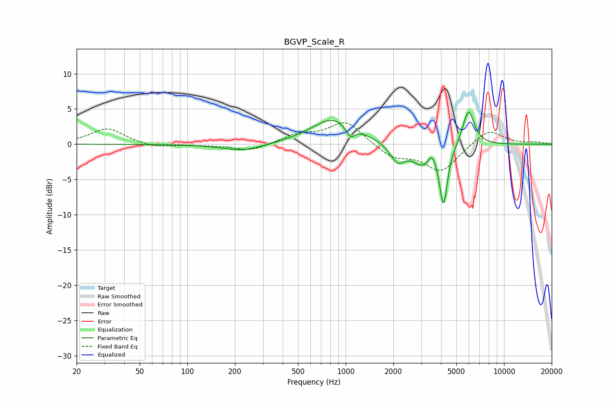

# BGVP_Scale_R
See [usage instructions](https://github.com/jaakkopasanen/AutoEq#usage) for more options and info.

### Parametric EQs
Apply preamp of -4.6 dB when using parametric equalizer.

|   # | Type    |   Fc (Hz) |    Q |   Gain (dB) |
|-----|---------|-----------|------|-------------|
|   1 | Peaking |       227 | 1.06 |        -1   |
|   2 | Peaking |       790 | 1.64 |         0.4 |
|   3 | Peaking |       863 | 0.92 |         3.5 |
|   4 | Peaking |      1072 | 4.81 |        -1.7 |
|   5 | Peaking |      2114 | 3.4  |        -2.1 |
|   6 | Peaking |      2650 | 3.69 |         0.5 |
|   7 | Peaking |      2991 | 1.59 |        -3.3 |
|   8 | Peaking |      3514 | 5.99 |         1.7 |
|   9 | Peaking |      4151 | 5.87 |        -7.9 |
|  10 | Peaking |      5958 | 3.68 |         5.2 |

### Fixed Band EQs
When using fixed band (also called graphic) equalizer, apply preamp of **-3.1 dB** (if available) and set gains manually with these parameters.

|   # | Type    |   Fc (Hz) |    Q |   Gain (dB) |
|-----|---------|-----------|------|-------------|
|   1 | Peaking |        31 | 1.41 |         2.3 |
|   2 | Peaking |        62 | 1.41 |        -0.5 |
|   3 | Peaking |       125 | 1.41 |        -0.1 |
|   4 | Peaking |       250 | 1.41 |        -1   |
|   5 | Peaking |       500 | 1.41 |         1.3 |
|   6 | Peaking |      1000 | 1.41 |         3.3 |
|   7 | Peaking |      2000 | 1.41 |        -1.9 |
|   8 | Peaking |      4000 | 1.41 |        -3.8 |
|   9 | Peaking |      8000 | 1.41 |         2.2 |
|  10 | Peaking |     16000 | 1.41 |         0.3 |

### Graphs

