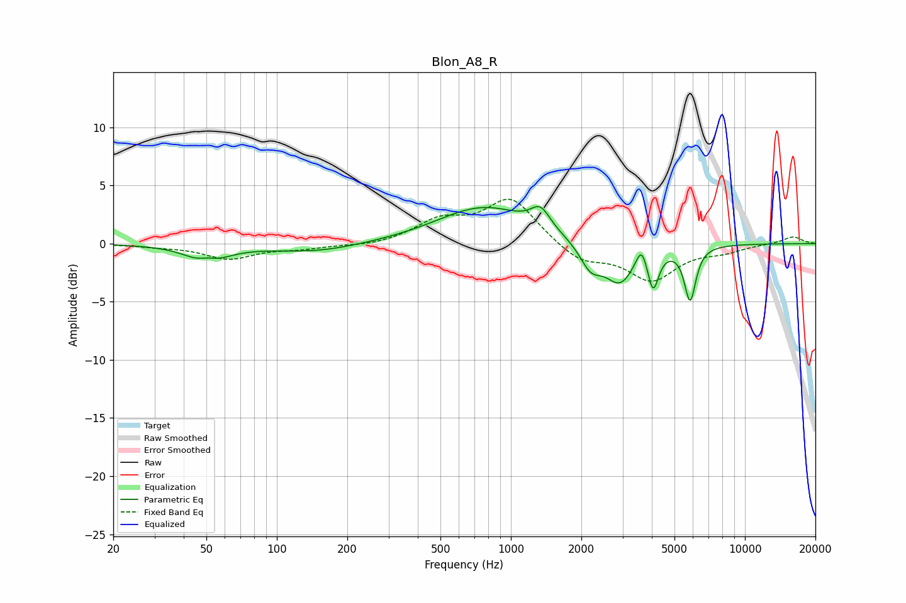

# Blon_A8_R
See [usage instructions](https://github.com/jaakkopasanen/AutoEq#usage) for more options and info.

### Parametric EQs
Apply preamp of -3.3 dB when using parametric equalizer.

|   # | Type    |   Fc (Hz) |    Q |   Gain (dB) |
|-----|---------|-----------|------|-------------|
|   1 | Peaking |        50 | 1.77 |        -1.7 |
|   2 | Peaking |        51 | 3.7  |         0.6 |
|   3 | Peaking |       146 | 0.74 |        -0.7 |
|   4 | Peaking |       765 | 0.71 |         3.1 |
|   5 | Peaking |      1339 | 3.42 |         1.7 |
|   6 | Peaking |      2193 | 3.03 |        -2.1 |
|   7 | Peaking |      2919 | 2.19 |        -3.3 |
|   8 | Peaking |      3617 | 6    |         1.8 |
|   9 | Peaking |      4051 | 6    |        -3.3 |
|  10 | Peaking |      5831 | 5.75 |        -4.6 |

### Fixed Band EQs
When using fixed band (also called graphic) equalizer, apply preamp of **-3.9 dB** (if available) and set gains manually with these parameters.

|   # | Type    |   Fc (Hz) |    Q |   Gain (dB) |
|-----|---------|-----------|------|-------------|
|   1 | Peaking |        31 | 1.41 |        -0.2 |
|   2 | Peaking |        62 | 1.41 |        -1.3 |
|   3 | Peaking |       125 | 1.41 |        -0.4 |
|   4 | Peaking |       250 | 1.41 |        -0.2 |
|   5 | Peaking |       500 | 1.41 |         1.8 |
|   6 | Peaking |      1000 | 1.41 |         3.9 |
|   7 | Peaking |      2000 | 1.41 |        -1.6 |
|   8 | Peaking |      4000 | 1.41 |        -3   |
|   9 | Peaking |      8000 | 1.41 |        -0.6 |
|  10 | Peaking |     16000 | 1.41 |         0.6 |

### Graphs

