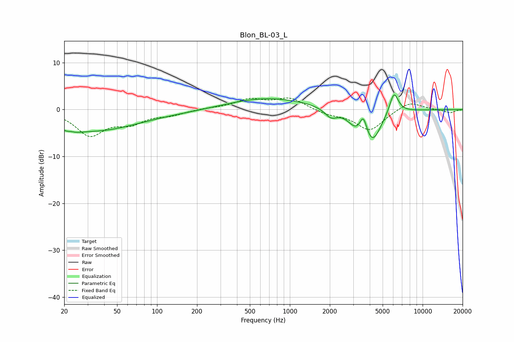

# Blon_BL-03_L
See [usage instructions](https://github.com/jaakkopasanen/AutoEq#usage) for more options and info.

### Parametric EQs
Apply preamp of -3.2 dB when using parametric equalizer.

|   # | Type    |   Fc (Hz) |    Q |   Gain (dB) |
|-----|---------|-----------|------|-------------|
|   1 | Peaking |        22 | 3.24 |        -4.1 |
|   2 | Peaking |        22 | 3.87 |         3.3 |
|   3 | Peaking |        33 | 0.45 |        -4   |
|   4 | Peaking |       101 | 0.22 |        -0.7 |
|   5 | Peaking |       657 | 0.45 |         2.6 |
|   6 | Peaking |      2039 | 3.02 |        -1.9 |
|   7 | Peaking |      3122 | 2.48 |        -2.6 |
|   8 | Peaking |      3576 | 5.56 |         3.4 |
|   9 | Peaking |      4199 | 2.17 |        -6.6 |
|  10 | Peaking |      6085 | 4.08 |         4.7 |

### Fixed Band EQs
When using fixed band (also called graphic) equalizer, apply preamp of **-2.6 dB** (if available) and set gains manually with these parameters.

|   # | Type    |   Fc (Hz) |    Q |   Gain (dB) |
|-----|---------|-----------|------|-------------|
|   1 | Peaking |        31 | 1.41 |        -5.3 |
|   2 | Peaking |        62 | 1.41 |        -2.5 |
|   3 | Peaking |       125 | 1.41 |        -1   |
|   4 | Peaking |       250 | 1.41 |         0.3 |
|   5 | Peaking |       500 | 1.41 |         2   |
|   6 | Peaking |      1000 | 1.41 |         2.4 |
|   7 | Peaking |      2000 | 1.41 |        -0.9 |
|   8 | Peaking |      4000 | 1.41 |        -4.4 |
|   9 | Peaking |      8000 | 1.41 |         1.8 |
|  10 | Peaking |     16000 | 1.41 |        -0.7 |

### Graphs

