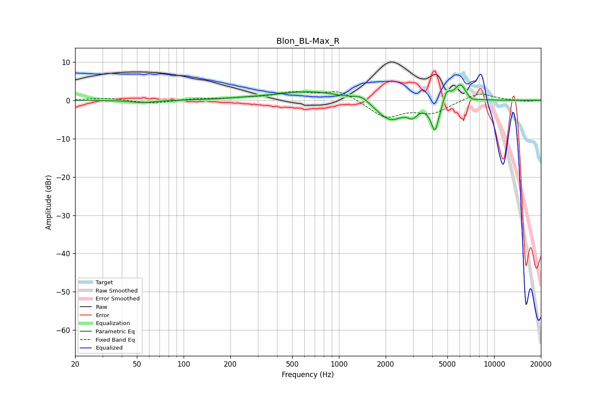

# Blon_BL-Max_R
See [usage instructions](https://github.com/jaakkopasanen/AutoEq#usage) for more options and info.

### Parametric EQs
Apply preamp of -4.1 dB when using parametric equalizer.

|   # | Type    |   Fc (Hz) |    Q |   Gain (dB) |
|-----|---------|-----------|------|-------------|
|   1 | Peaking |        55 | 1.9  |        -0.6 |
|   2 | Peaking |       248 | 1.27 |         0.2 |
|   3 | Peaking |       661 | 0.63 |         2.4 |
|   4 | Peaking |      1400 | 2.95 |         1.5 |
|   5 | Peaking |      2139 | 1.55 |        -5.4 |
|   6 | Peaking |      2982 | 4.5  |        -2.3 |
|   7 | Peaking |      4158 | 5.24 |        -7.8 |
|   8 | Peaking |      4950 | 6    |         2.9 |
|   9 | Peaking |      6063 | 3.36 |         4.6 |
|  10 | Peaking |      7087 | 4.58 |        -1   |

### Fixed Band EQs
When using fixed band (also called graphic) equalizer, apply preamp of **-2.4 dB** (if available) and set gains manually with these parameters.

|   # | Type    |   Fc (Hz) |    Q |   Gain (dB) |
|-----|---------|-----------|------|-------------|
|   1 | Peaking |        31 | 1.41 |         0.6 |
|   2 | Peaking |        62 | 1.41 |        -0.9 |
|   3 | Peaking |       125 | 1.41 |         0.4 |
|   4 | Peaking |       250 | 1.41 |         0.5 |
|   5 | Peaking |       500 | 1.41 |         1.9 |
|   6 | Peaking |      1000 | 1.41 |         2.6 |
|   7 | Peaking |      2000 | 1.41 |        -4.4 |
|   8 | Peaking |      4000 | 1.41 |        -3.1 |
|   9 | Peaking |      8000 | 1.41 |         2.1 |
|  10 | Peaking |     16000 | 1.41 |        -0.3 |

### Graphs

