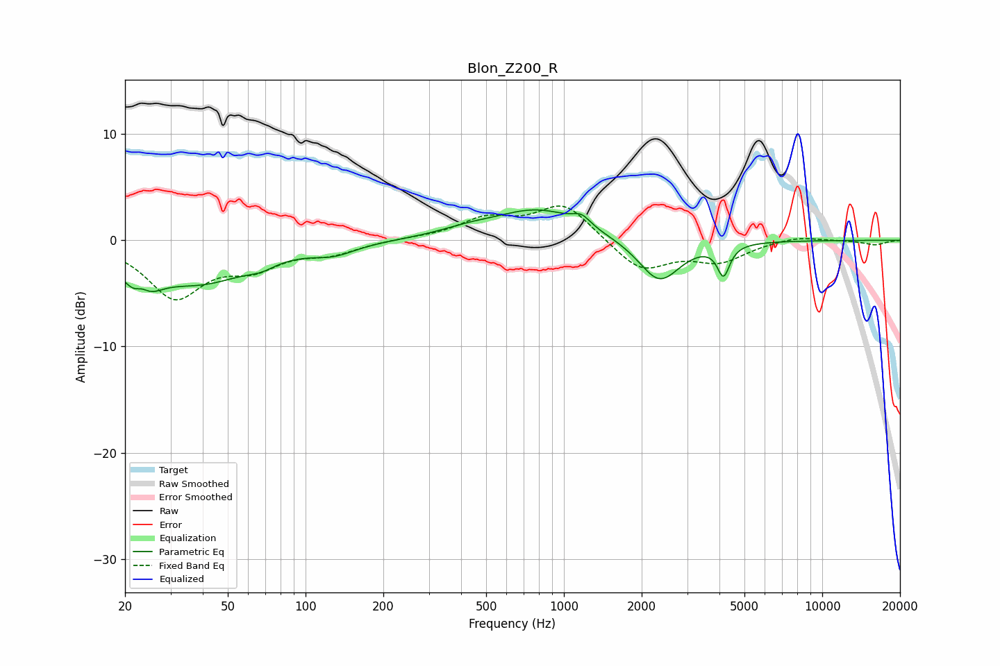

# Blon_Z200_R
See [usage instructions](https://github.com/jaakkopasanen/AutoEq#usage) for more options and info.

### Parametric EQs
Apply preamp of -3.0 dB when using parametric equalizer.

|   # | Type    |   Fc (Hz) |    Q |   Gain (dB) |
|-----|---------|-----------|------|-------------|
|   1 | Peaking |        23 | 2.59 |        -4.6 |
|   2 | Peaking |        23 | 4.25 |         2.4 |
|   3 | Peaking |        39 | 0.71 |        -3.7 |
|   4 | Peaking |        67 | 2.65 |        -0.6 |
|   5 | Peaking |       129 | 1.67 |        -0.9 |
|   6 | Peaking |       422 | 1.29 |         0.5 |
|   7 | Peaking |       795 | 0.83 |         2.9 |
|   8 | Peaking |      1171 | 4.15 |         0.9 |
|   9 | Peaking |      2343 | 1.77 |        -4.1 |
|  10 | Peaking |      4147 | 6    |        -2.9 |

### Fixed Band EQs
When using fixed band (also called graphic) equalizer, apply preamp of **-3.3 dB** (if available) and set gains manually with these parameters.

|   # | Type    |   Fc (Hz) |    Q |   Gain (dB) |
|-----|---------|-----------|------|-------------|
|   1 | Peaking |        31 | 1.41 |        -5.2 |
|   2 | Peaking |        62 | 1.41 |        -2.1 |
|   3 | Peaking |       125 | 1.41 |        -1.1 |
|   4 | Peaking |       250 | 1.41 |         0.1 |
|   5 | Peaking |       500 | 1.41 |         1.9 |
|   6 | Peaking |      1000 | 1.41 |         3.4 |
|   7 | Peaking |      2000 | 1.41 |        -2.9 |
|   8 | Peaking |      4000 | 1.41 |        -1.9 |
|   9 | Peaking |      8000 | 1.41 |         0.5 |
|  10 | Peaking |     16000 | 1.41 |        -0.4 |

### Graphs

