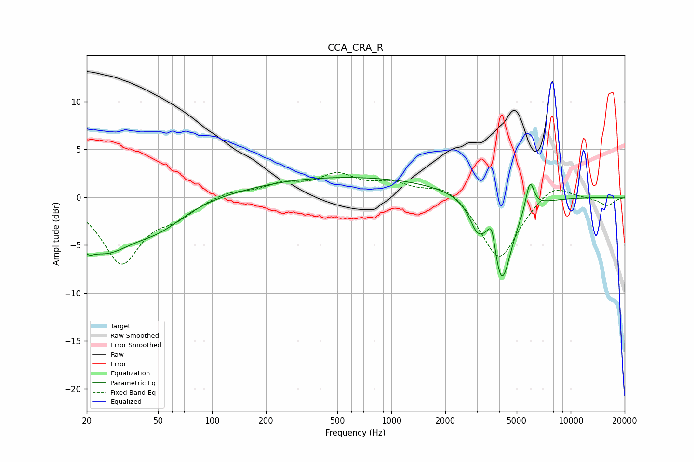

# CCA_CRA_R
See [usage instructions](https://github.com/jaakkopasanen/AutoEq#usage) for more options and info.

### Parametric EQs
Apply preamp of -2.2 dB when using parametric equalizer.

|   # | Type    |   Fc (Hz) |    Q |   Gain (dB) |
|-----|---------|-----------|------|-------------|
|   1 | Peaking |        20 | 5.5  |         3.4 |
|   2 | Peaking |        20 | 5.24 |        -4.6 |
|   3 | Peaking |        25 | 0.88 |        -5   |
|   4 | Peaking |        51 | 0.95 |        -2.2 |
|   5 | Peaking |       156 | 0.65 |        -0.2 |
|   6 | Peaking |       522 | 0.23 |         2.2 |
|   7 | Peaking |      3009 | 3.34 |        -2.3 |
|   8 | Peaking |      3634 | 6    |         3.1 |
|   9 | Peaking |      4109 | 2.46 |        -9.3 |
|  10 | Peaking |      5928 | 6    |         3.1 |

### Fixed Band EQs
When using fixed band (also called graphic) equalizer, apply preamp of **-2.7 dB** (if available) and set gains manually with these parameters.

|   # | Type    |   Fc (Hz) |    Q |   Gain (dB) |
|-----|---------|-----------|------|-------------|
|   1 | Peaking |        31 | 1.41 |        -6.7 |
|   2 | Peaking |        62 | 1.41 |        -1.6 |
|   3 | Peaking |       125 | 1.41 |         0.6 |
|   4 | Peaking |       250 | 1.41 |         1.2 |
|   5 | Peaking |       500 | 1.41 |         2.1 |
|   6 | Peaking |      1000 | 1.41 |         1.3 |
|   7 | Peaking |      2000 | 1.41 |         1.5 |
|   8 | Peaking |      4000 | 1.41 |        -6.7 |
|   9 | Peaking |      8000 | 1.41 |         1.6 |
|  10 | Peaking |     16000 | 1.41 |        -0.9 |

### Graphs

