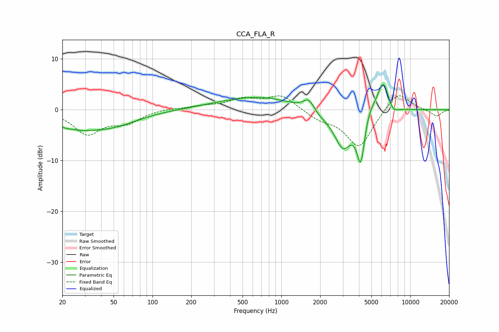

# CCA_FLA_R
See [usage instructions](https://github.com/jaakkopasanen/AutoEq#usage) for more options and info.

### Parametric EQs
Apply preamp of -5.1 dB when using parametric equalizer.

|   # | Type    |   Fc (Hz) |    Q |   Gain (dB) |
|-----|---------|-----------|------|-------------|
|   1 | Peaking |        25 | 0.57 |        -3.3 |
|   2 | Peaking |        53 | 0.76 |        -1.7 |
|   3 | Peaking |       679 | 0.45 |         2.6 |
|   4 | Peaking |      1643 | 2.8  |         3.5 |
|   5 | Peaking |      1780 | 1.43 |        -2.3 |
|   6 | Peaking |      2998 | 2.08 |        -7   |
|   7 | Peaking |      4130 | 4.36 |        -9.6 |
|   8 | Peaking |      4803 | 3.17 |         1.9 |
|   9 | Peaking |      6179 | 3    |         6.4 |
|  10 | Peaking |      7265 | 3.19 |        -1.8 |

### Fixed Band EQs
When using fixed band (also called graphic) equalizer, apply preamp of **-2.8 dB** (if available) and set gains manually with these parameters.

|   # | Type    |   Fc (Hz) |    Q |   Gain (dB) |
|-----|---------|-----------|------|-------------|
|   1 | Peaking |        31 | 1.41 |        -4.6 |
|   2 | Peaking |        62 | 1.41 |        -2.3 |
|   3 | Peaking |       125 | 1.41 |         0.3 |
|   4 | Peaking |       250 | 1.41 |         0.6 |
|   5 | Peaking |       500 | 1.41 |         1.9 |
|   6 | Peaking |      1000 | 1.41 |         2.8 |
|   7 | Peaking |      2000 | 1.41 |        -1.6 |
|   8 | Peaking |      4000 | 1.41 |        -7.4 |
|   9 | Peaking |      8000 | 1.41 |         3.9 |
|  10 | Peaking |     16000 | 1.41 |        -1.3 |

### Graphs

