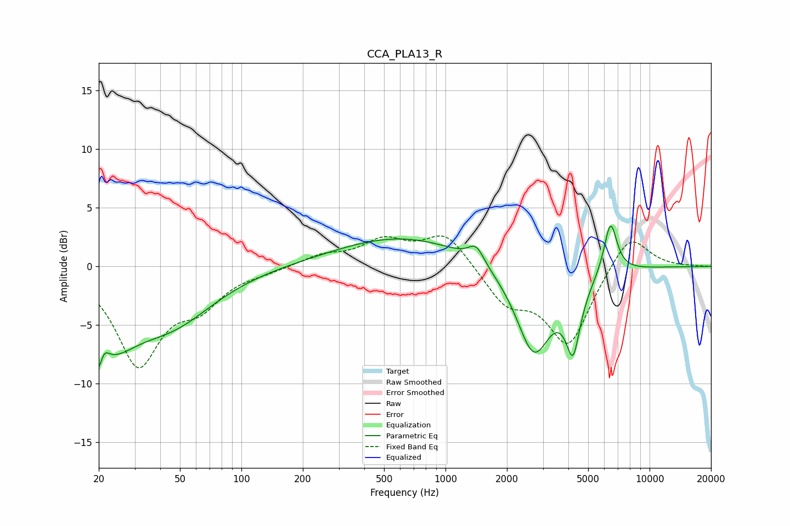

# CCA_PLA13_R
See [usage instructions](https://github.com/jaakkopasanen/AutoEq#usage) for more options and info.

### Parametric EQs
Apply preamp of -3.5 dB when using parametric equalizer.

|   # | Type    |   Fc (Hz) |    Q |   Gain (dB) |
|-----|---------|-----------|------|-------------|
|   1 | Peaking |        20 | 4.92 |        -4.7 |
|   2 | Peaking |        21 | 5.4  |         3.2 |
|   3 | Peaking |        22 | 1.02 |        -5.3 |
|   4 | Peaking |        46 | 0.67 |        -4.1 |
|   5 | Peaking |       611 | 0.44 |         2.5 |
|   6 | Peaking |      1414 | 3.7  |         1.5 |
|   7 | Peaking |      2709 | 1.63 |        -7.5 |
|   8 | Peaking |      4241 | 3.91 |        -8.6 |
|   9 | Peaking |      4281 | 4.4  |         2.8 |
|  10 | Peaking |      6435 | 4.29 |         4.5 |

### Fixed Band EQs
When using fixed band (also called graphic) equalizer, apply preamp of **-2.7 dB** (if available) and set gains manually with these parameters.

|   # | Type    |   Fc (Hz) |    Q |   Gain (dB) |
|-----|---------|-----------|------|-------------|
|   1 | Peaking |        31 | 1.41 |        -8.1 |
|   2 | Peaking |        62 | 1.41 |        -2.7 |
|   3 | Peaking |       125 | 1.41 |        -0.3 |
|   4 | Peaking |       250 | 1.41 |         0.9 |
|   5 | Peaking |       500 | 1.41 |         2   |
|   6 | Peaking |      1000 | 1.41 |         2.9 |
|   7 | Peaking |      2000 | 1.41 |        -2.9 |
|   8 | Peaking |      4000 | 1.41 |        -6.6 |
|   9 | Peaking |      8000 | 1.41 |         3.1 |
|  10 | Peaking |     16000 | 1.41 |         0   |

### Graphs

