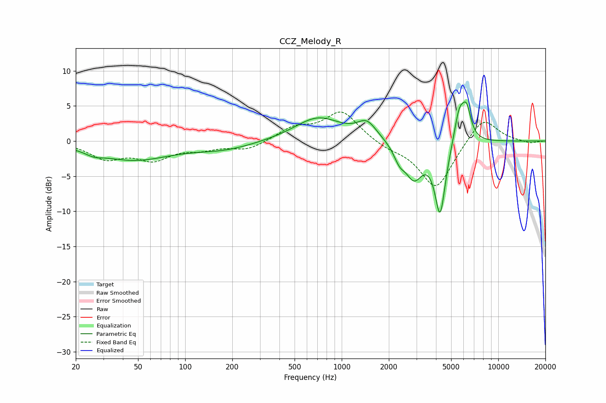

# CCZ_Melody_R
See [usage instructions](https://github.com/jaakkopasanen/AutoEq#usage) for more options and info.

### Parametric EQs
Apply preamp of -5.7 dB when using parametric equalizer.

|   # | Type    |   Fc (Hz) |    Q |   Gain (dB) |
|-----|---------|-----------|------|-------------|
|   1 | Peaking |        26 | 2.78 |        -0.6 |
|   2 | Peaking |        46 | 0.6  |        -2.6 |
|   3 | Peaking |       179 | 0.74 |        -1.1 |
|   4 | Peaking |       706 | 0.95 |         3.4 |
|   5 | Peaking |      1449 | 2.29 |         2.3 |
|   6 | Peaking |      2335 | 3.86 |        -1.9 |
|   7 | Peaking |      2895 | 2.5  |        -4.8 |
|   8 | Peaking |      4252 | 4.04 |       -10.2 |
|   9 | Peaking |      5635 | 4.03 |         4.8 |
|  10 | Peaking |      6274 | 4.83 |         4   |

### Fixed Band EQs
When using fixed band (also called graphic) equalizer, apply preamp of **-4.2 dB** (if available) and set gains manually with these parameters.

|   # | Type    |   Fc (Hz) |    Q |   Gain (dB) |
|-----|---------|-----------|------|-------------|
|   1 | Peaking |        31 | 1.41 |        -2.3 |
|   2 | Peaking |        62 | 1.41 |        -2.4 |
|   3 | Peaking |       125 | 1.41 |        -0.9 |
|   4 | Peaking |       250 | 1.41 |        -1.2 |
|   5 | Peaking |       500 | 1.41 |         1.8 |
|   6 | Peaking |      1000 | 1.41 |         4.2 |
|   7 | Peaking |      2000 | 1.41 |        -0.8 |
|   8 | Peaking |      4000 | 1.41 |        -6.9 |
|   9 | Peaking |      8000 | 1.41 |         3.7 |
|  10 | Peaking |     16000 | 1.41 |        -0.3 |

### Graphs

