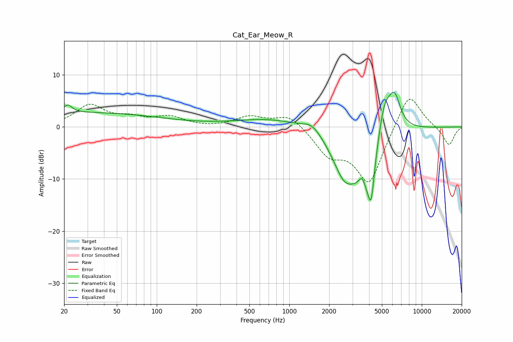

# Cat_Ear_Meow_R
See [usage instructions](https://github.com/jaakkopasanen/AutoEq#usage) for more options and info.

### Parametric EQs
Apply preamp of -6.8 dB when using parametric equalizer.

|   # | Type    |   Fc (Hz) |    Q |   Gain (dB) |
|-----|---------|-----------|------|-------------|
|   1 | Peaking |        21 | 4.83 |         1.4 |
|   2 | Peaking |        23 | 0.18 |         2.8 |
|   3 | Peaking |       730 | 0.54 |         1.6 |
|   4 | Peaking |      1488 | 2.17 |         1.7 |
|   5 | Peaking |      2595 | 1.55 |        -7.4 |
|   6 | Peaking |      3556 | 4.63 |         4.2 |
|   7 | Peaking |      3705 | 1.73 |       -11.4 |
|   8 | Peaking |      4152 | 5.96 |        -7.2 |
|   9 | Peaking |      5241 | 2.56 |         7.6 |
|  10 | Peaking |      6244 | 3.05 |         6   |

### Fixed Band EQs
When using fixed band (also called graphic) equalizer, apply preamp of **-5.4 dB** (if available) and set gains manually with these parameters.

|   # | Type    |   Fc (Hz) |    Q |   Gain (dB) |
|-----|---------|-----------|------|-------------|
|   1 | Peaking |        31 | 1.41 |         4   |
|   2 | Peaking |        62 | 1.41 |         1.4 |
|   3 | Peaking |       125 | 1.41 |         1.8 |
|   4 | Peaking |       250 | 1.41 |        -0.1 |
|   5 | Peaking |       500 | 1.41 |         1.9 |
|   6 | Peaking |      1000 | 1.41 |         2.5 |
|   7 | Peaking |      2000 | 1.41 |        -4.7 |
|   8 | Peaking |      4000 | 1.41 |       -10.9 |
|   9 | Peaking |      8000 | 1.41 |         7.3 |
|  10 | Peaking |     16000 | 1.41 |        -3.6 |

### Graphs

