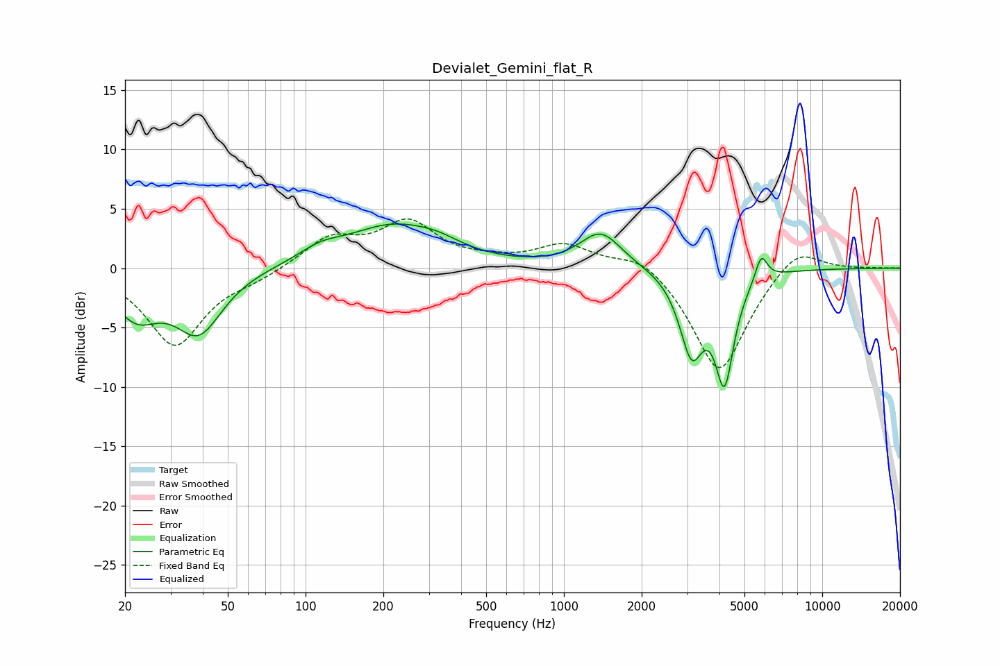

# Devialet_Gemini_flat_R
See [usage instructions](https://github.com/jaakkopasanen/AutoEq#usage) for more options and info.

### Parametric EQs
Apply preamp of -3.8 dB when using parametric equalizer.

|   # | Type    |   Fc (Hz) |    Q |   Gain (dB) |
|-----|---------|-----------|------|-------------|
|   1 | Peaking |        22 | 1.83 |        -1.6 |
|   2 | Peaking |        22 | 1.38 |        -2   |
|   3 | Peaking |        39 | 1.56 |        -5.1 |
|   4 | Peaking |       114 | 1.67 |         1   |
|   5 | Peaking |       216 | 0.78 |         3.4 |
|   6 | Peaking |       325 | 1.55 |         0.7 |
|   7 | Peaking |      1389 | 1.76 |         3   |
|   8 | Peaking |      3119 | 3.02 |        -6.6 |
|   9 | Peaking |      4184 | 3.83 |        -8.7 |
|  10 | Peaking |      5807 | 6    |         2.2 |

### Fixed Band EQs
When using fixed band (also called graphic) equalizer, apply preamp of **-4.2 dB** (if available) and set gains manually with these parameters.

|   # | Type    |   Fc (Hz) |    Q |   Gain (dB) |
|-----|---------|-----------|------|-------------|
|   1 | Peaking |        31 | 1.41 |        -6.5 |
|   2 | Peaking |        62 | 1.41 |        -0.7 |
|   3 | Peaking |       125 | 1.41 |         2.4 |
|   4 | Peaking |       250 | 1.41 |         3.6 |
|   5 | Peaking |       500 | 1.41 |         0.4 |
|   6 | Peaking |      1000 | 1.41 |         1.9 |
|   7 | Peaking |      2000 | 1.41 |         1.5 |
|   8 | Peaking |      4000 | 1.41 |        -9   |
|   9 | Peaking |      8000 | 1.41 |         2.2 |
|  10 | Peaking |     16000 | 1.41 |         0   |

### Graphs

