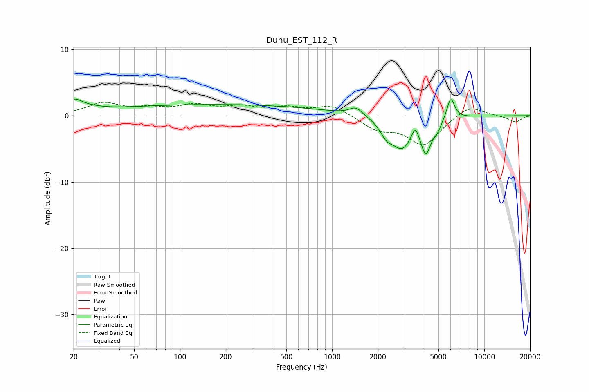

# Dunu_EST_112_R
See [usage instructions](https://github.com/jaakkopasanen/AutoEq#usage) for more options and info.

### Parametric EQs
Apply preamp of -2.6 dB when using parametric equalizer.

|   # | Type    |   Fc (Hz) |    Q |   Gain (dB) |
|-----|---------|-----------|------|-------------|
|   1 | Peaking |        20 | 2.52 |         1.8 |
|   2 | Peaking |        26 | 1.5  |         0.4 |
|   3 | Peaking |       174 | 0.18 |         1.7 |
|   4 | Peaking |      1433 | 3.37 |         1.2 |
|   5 | Peaking |      2275 | 3.45 |        -1.9 |
|   6 | Peaking |      2877 | 2.07 |        -4.5 |
|   7 | Peaking |      3523 | 6    |         2   |
|   8 | Peaking |      4133 | 4.2  |        -4.8 |
|   9 | Peaking |      4926 | 5.53 |        -1.2 |
|  10 | Peaking |      6023 | 5.53 |         3.3 |

### Fixed Band EQs
When using fixed band (also called graphic) equalizer, apply preamp of **-2.1 dB** (if available) and set gains manually with these parameters.

|   # | Type    |   Fc (Hz) |    Q |   Gain (dB) |
|-----|---------|-----------|------|-------------|
|   1 | Peaking |        31 | 1.41 |         1.8 |
|   2 | Peaking |        62 | 1.41 |         0.9 |
|   3 | Peaking |       125 | 1.41 |         1.4 |
|   4 | Peaking |       250 | 1.41 |         1.1 |
|   5 | Peaking |       500 | 1.41 |         1   |
|   6 | Peaking |      1000 | 1.41 |         1.6 |
|   7 | Peaking |      2000 | 1.41 |        -1.9 |
|   8 | Peaking |      4000 | 1.41 |        -4.3 |
|   9 | Peaking |      8000 | 1.41 |         1.7 |
|  10 | Peaking |     16000 | 1.41 |        -1   |

### Graphs

