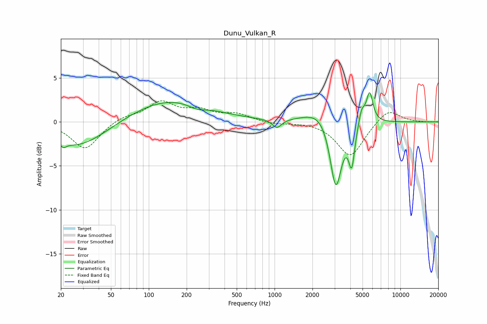

# Dunu_Vulkan_R
See [usage instructions](https://github.com/jaakkopasanen/AutoEq#usage) for more options and info.

### Parametric EQs
Apply preamp of -3.4 dB when using parametric equalizer.

|   # | Type    |   Fc (Hz) |    Q |   Gain (dB) |
|-----|---------|-----------|------|-------------|
|   1 | Peaking |        21 | 5.85 |        -0.5 |
|   2 | Peaking |        27 | 0.63 |        -2.9 |
|   3 | Peaking |       146 | 0.46 |         2.6 |
|   4 | Peaking |       241 | 1.98 |        -0.5 |
|   5 | Peaking |      1044 | 3.85 |        -1   |
|   6 | Peaking |      2382 | 1.16 |         1.8 |
|   7 | Peaking |      3063 | 2.97 |        -8.3 |
|   8 | Peaking |      4101 | 6    |        -4.4 |
|   9 | Peaking |      4917 | 5.98 |         1.7 |
|  10 | Peaking |      5691 | 5.32 |         3.4 |

### Fixed Band EQs
When using fixed band (also called graphic) equalizer, apply preamp of **-2.5 dB** (if available) and set gains manually with these parameters.

|   # | Type    |   Fc (Hz) |    Q |   Gain (dB) |
|-----|---------|-----------|------|-------------|
|   1 | Peaking |        31 | 1.41 |        -3.1 |
|   2 | Peaking |        62 | 1.41 |         0.6 |
|   3 | Peaking |       125 | 1.41 |         2.2 |
|   4 | Peaking |       250 | 1.41 |         1.1 |
|   5 | Peaking |       500 | 1.41 |         0.8 |
|   6 | Peaking |      1000 | 1.41 |        -0.3 |
|   7 | Peaking |      2000 | 1.41 |         0.1 |
|   8 | Peaking |      4000 | 1.41 |        -4   |
|   9 | Peaking |      8000 | 1.41 |         1.6 |
|  10 | Peaking |     16000 | 1.41 |        -0   |

### Graphs

