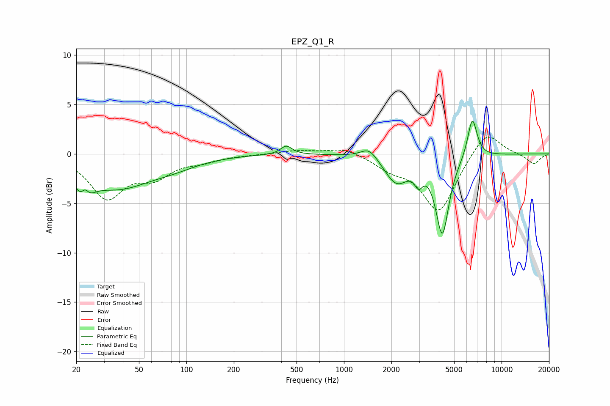

# EPZ_Q1_R
See [usage instructions](https://github.com/jaakkopasanen/AutoEq#usage) for more options and info.

### Parametric EQs
Apply preamp of -3.4 dB when using parametric equalizer.

|   # | Type    |   Fc (Hz) |    Q |   Gain (dB) |
|-----|---------|-----------|------|-------------|
|   1 | Peaking |        22 | 3.18 |        -3.7 |
|   2 | Peaking |        23 | 5.24 |         2.3 |
|   3 | Peaking |        37 | 0.66 |        -3.2 |
|   4 | Peaking |        84 | 0.91 |        -0.7 |
|   5 | Peaking |       431 | 3.9  |         0.9 |
|   6 | Peaking |      1445 | 2.66 |         1.2 |
|   7 | Peaking |      2152 | 1.89 |        -2.8 |
|   8 | Peaking |      2976 | 5.48 |        -1.5 |
|   9 | Peaking |      4208 | 3.38 |        -7.9 |
|  10 | Peaking |      6523 | 4.57 |         4.1 |

### Fixed Band EQs
When using fixed band (also called graphic) equalizer, apply preamp of **-1.8 dB** (if available) and set gains manually with these parameters.

|   # | Type    |   Fc (Hz) |    Q |   Gain (dB) |
|-----|---------|-----------|------|-------------|
|   1 | Peaking |        31 | 1.41 |        -4.3 |
|   2 | Peaking |        62 | 1.41 |        -2   |
|   3 | Peaking |       125 | 1.41 |        -0.6 |
|   4 | Peaking |       250 | 1.41 |        -0   |
|   5 | Peaking |       500 | 1.41 |         0.3 |
|   6 | Peaking |      1000 | 1.41 |         0.7 |
|   7 | Peaking |      2000 | 1.41 |        -1.2 |
|   8 | Peaking |      4000 | 1.41 |        -5.8 |
|   9 | Peaking |      8000 | 1.41 |         2.6 |
|  10 | Peaking |     16000 | 1.41 |        -1   |

### Graphs

