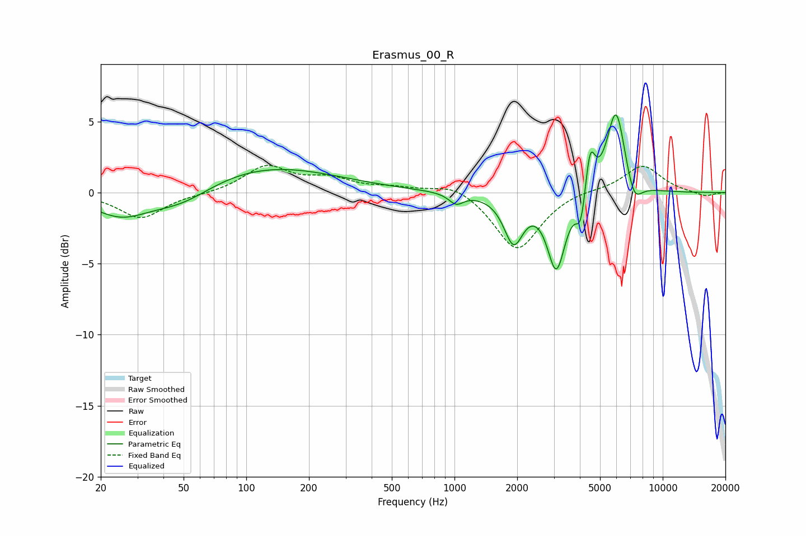

# Erasmus_00_R
See [usage instructions](https://github.com/jaakkopasanen/AutoEq#usage) for more options and info.

### Parametric EQs
Apply preamp of -5.5 dB when using parametric equalizer.

|   # | Type    |   Fc (Hz) |    Q |   Gain (dB) |
|-----|---------|-----------|------|-------------|
|   1 | Peaking |        25 | 1.04 |        -1.7 |
|   2 | Peaking |        49 | 0.91 |        -1.3 |
|   3 | Peaking |       121 | 0.41 |         1.9 |
|   4 | Peaking |      1019 | 4.05 |        -0.7 |
|   5 | Peaking |      1922 | 3.08 |        -3.3 |
|   6 | Peaking |      3084 | 3.26 |        -5.3 |
|   7 | Peaking |      4049 | 6    |        -2.4 |
|   8 | Peaking |      4477 | 5.99 |         3.2 |
|   9 | Peaking |      5969 | 3.09 |         6.1 |
|  10 | Peaking |      7268 | 3.61 |        -1.8 |

### Fixed Band EQs
When using fixed band (also called graphic) equalizer, apply preamp of **-2.0 dB** (if available) and set gains manually with these parameters.

|   # | Type    |   Fc (Hz) |    Q |   Gain (dB) |
|-----|---------|-----------|------|-------------|
|   1 | Peaking |        31 | 1.41 |        -1.8 |
|   2 | Peaking |        62 | 1.41 |        -0.1 |
|   3 | Peaking |       125 | 1.41 |         1.8 |
|   4 | Peaking |       250 | 1.41 |         0.9 |
|   5 | Peaking |       500 | 1.41 |         0.3 |
|   6 | Peaking |      1000 | 1.41 |         0.7 |
|   7 | Peaking |      2000 | 1.41 |        -4.1 |
|   8 | Peaking |      4000 | 1.41 |         0.2 |
|   9 | Peaking |      8000 | 1.41 |         1.9 |
|  10 | Peaking |     16000 | 1.41 |        -0.3 |

### Graphs

