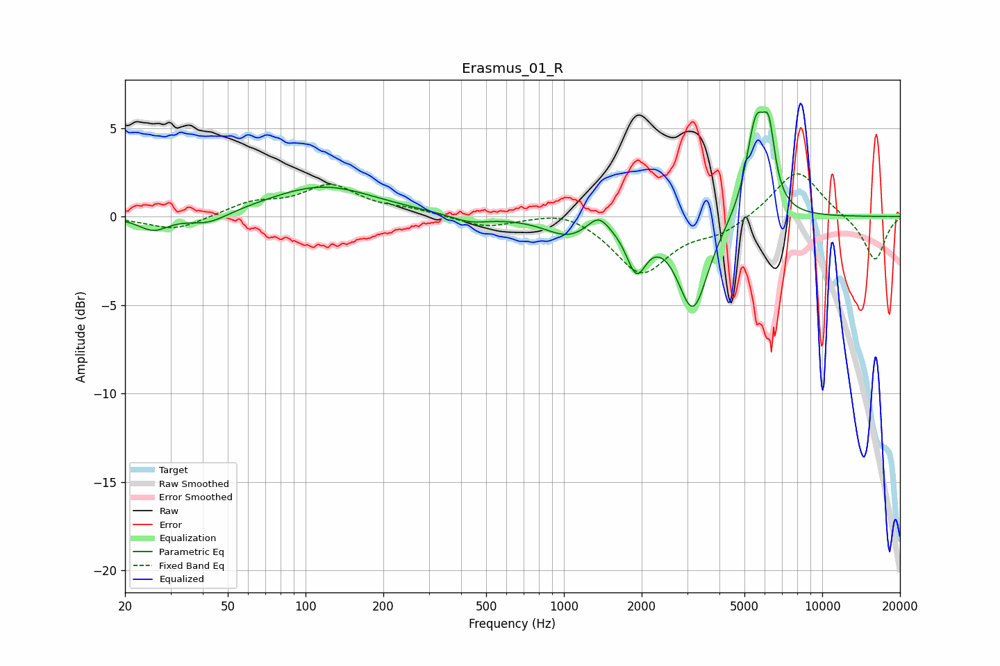

# Erasmus_01_R
See [usage instructions](https://github.com/jaakkopasanen/AutoEq#usage) for more options and info.

### Parametric EQs
Apply preamp of -6.0 dB when using parametric equalizer.

|   # | Type    |   Fc (Hz) |    Q |   Gain (dB) |
|-----|---------|-----------|------|-------------|
|   1 | Peaking |        26 | 2.4  |        -0.8 |
|   2 | Peaking |        42 | 1.82 |        -0.6 |
|   3 | Peaking |       116 | 0.69 |         1.7 |
|   4 | Peaking |       432 | 1.85 |        -0.4 |
|   5 | Peaking |      1038 | 1.6  |        -1   |
|   6 | Peaking |      1360 | 3.5  |         0.9 |
|   7 | Peaking |      1908 | 3.69 |        -2.5 |
|   8 | Peaking |      3161 | 2.4  |        -5.2 |
|   9 | Peaking |      5542 | 3.6  |         5.3 |
|  10 | Peaking |      6219 | 6    |         3.2 |

### Fixed Band EQs
When using fixed band (also called graphic) equalizer, apply preamp of **-2.5 dB** (if available) and set gains manually with these parameters.

|   # | Type    |   Fc (Hz) |    Q |   Gain (dB) |
|-----|---------|-----------|------|-------------|
|   1 | Peaking |        31 | 1.41 |        -0.8 |
|   2 | Peaking |        62 | 1.41 |         0.7 |
|   3 | Peaking |       125 | 1.41 |         1.7 |
|   4 | Peaking |       250 | 1.41 |         0.3 |
|   5 | Peaking |       500 | 1.41 |        -0.6 |
|   6 | Peaking |      1000 | 1.41 |         0.5 |
|   7 | Peaking |      2000 | 1.41 |        -3.2 |
|   8 | Peaking |      4000 | 1.41 |        -0.8 |
|   9 | Peaking |      8000 | 1.41 |         2.7 |
|  10 | Peaking |     16000 | 1.41 |        -2.5 |

### Graphs

