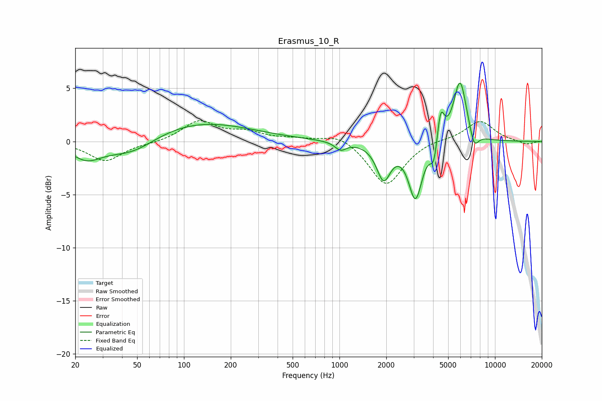

# Erasmus_10_R
See [usage instructions](https://github.com/jaakkopasanen/AutoEq#usage) for more options and info.

### Parametric EQs
Apply preamp of -5.6 dB when using parametric equalizer.

|   # | Type    |   Fc (Hz) |    Q |   Gain (dB) |
|-----|---------|-----------|------|-------------|
|   1 | Peaking |        24 | 1.45 |        -1.6 |
|   2 | Peaking |        46 | 0.86 |        -1.7 |
|   3 | Peaking |       118 | 0.4  |         1.9 |
|   4 | Peaking |      1017 | 3.98 |        -0.8 |
|   5 | Peaking |      1922 | 3.18 |        -3.3 |
|   6 | Peaking |      3080 | 3.26 |        -5.3 |
|   7 | Peaking |      4054 | 6    |        -2.3 |
|   8 | Peaking |      4469 | 6    |         3.2 |
|   9 | Peaking |      5961 | 3.26 |         5.9 |
|  10 | Peaking |      7341 | 4.8  |        -1.6 |

### Fixed Band EQs
When using fixed band (also called graphic) equalizer, apply preamp of **-2.0 dB** (if available) and set gains manually with these parameters.

|   # | Type    |   Fc (Hz) |    Q |   Gain (dB) |
|-----|---------|-----------|------|-------------|
|   1 | Peaking |        31 | 1.41 |        -1.8 |
|   2 | Peaking |        62 | 1.41 |        -0.2 |
|   3 | Peaking |       125 | 1.41 |         1.9 |
|   4 | Peaking |       250 | 1.41 |         0.8 |
|   5 | Peaking |       500 | 1.41 |         0.2 |
|   6 | Peaking |      1000 | 1.41 |         0.8 |
|   7 | Peaking |      2000 | 1.41 |        -4.2 |
|   8 | Peaking |      4000 | 1.41 |         0.2 |
|   9 | Peaking |      8000 | 1.41 |         2   |
|  10 | Peaking |     16000 | 1.41 |        -0.3 |

### Graphs

