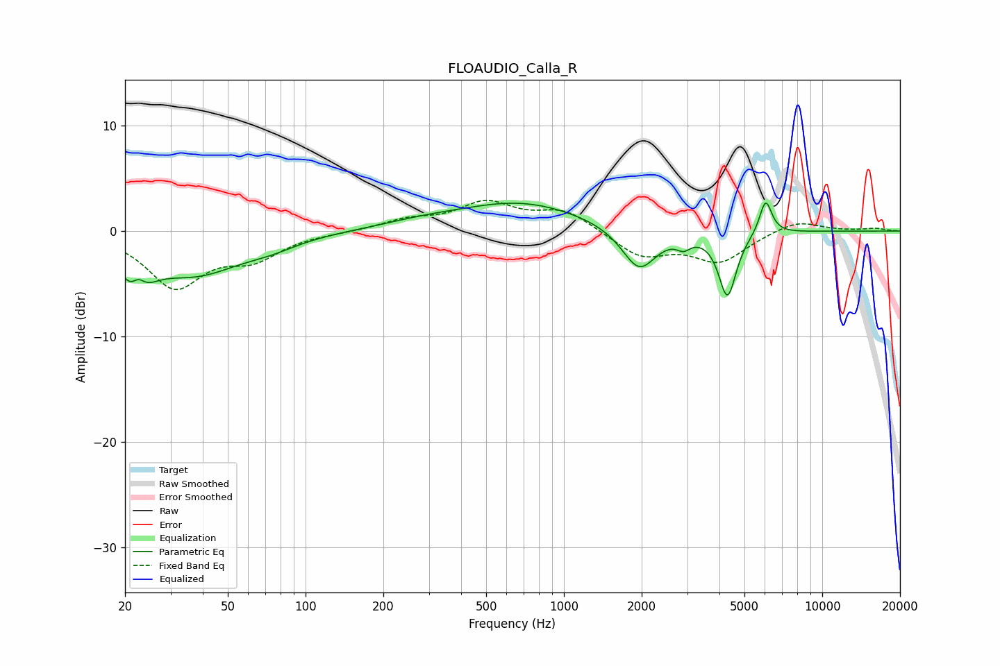

# FLOAUDIO_Calla_R
See [usage instructions](https://github.com/jaakkopasanen/AutoEq#usage) for more options and info.

### Parametric EQs
Apply preamp of -2.7 dB when using parametric equalizer.

|   # | Type    |   Fc (Hz) |    Q |   Gain (dB) |
|-----|---------|-----------|------|-------------|
|   1 | Peaking |        22 | 2.67 |        -4.6 |
|   2 | Peaking |        22 | 4.98 |         2.3 |
|   3 | Peaking |        37 | 0.77 |        -3.8 |
|   4 | Peaking |        74 | 1.37 |        -0.7 |
|   5 | Peaking |       280 | 0.9  |         0.5 |
|   6 | Peaking |       680 | 0.58 |         2.7 |
|   7 | Peaking |      1955 | 2.11 |        -4.1 |
|   8 | Peaking |      2905 | 5.35 |        -0.9 |
|   9 | Peaking |      4298 | 4.13 |        -6.1 |
|  10 | Peaking |      6038 | 5.83 |         3.3 |

### Fixed Band EQs
When using fixed band (also called graphic) equalizer, apply preamp of **-3.0 dB** (if available) and set gains manually with these parameters.

|   # | Type    |   Fc (Hz) |    Q |   Gain (dB) |
|-----|---------|-----------|------|-------------|
|   1 | Peaking |        31 | 1.41 |        -5.1 |
|   2 | Peaking |        62 | 1.41 |        -2.3 |
|   3 | Peaking |       125 | 1.41 |        -0.1 |
|   4 | Peaking |       250 | 1.41 |         0.9 |
|   5 | Peaking |       500 | 1.41 |         2.5 |
|   6 | Peaking |      1000 | 1.41 |         1.9 |
|   7 | Peaking |      2000 | 1.41 |        -2.4 |
|   8 | Peaking |      4000 | 1.41 |        -2.8 |
|   9 | Peaking |      8000 | 1.41 |         1.1 |
|  10 | Peaking |     16000 | 1.41 |         0.2 |

### Graphs

