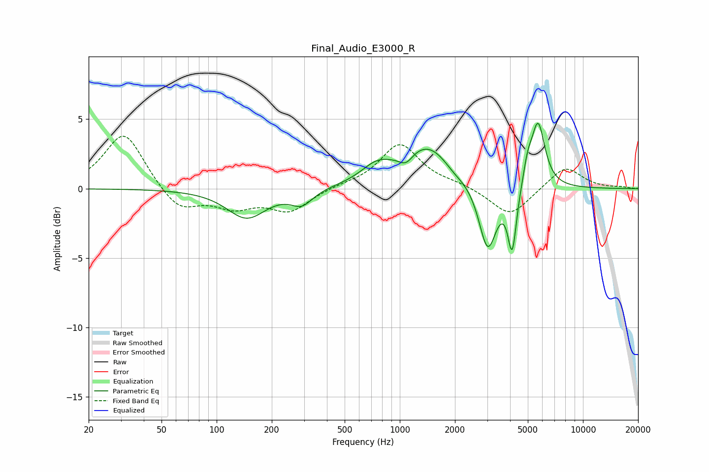

# Final_Audio_E3000_R
See [usage instructions](https://github.com/jaakkopasanen/AutoEq#usage) for more options and info.

### Parametric EQs
Apply preamp of -4.8 dB when using parametric equalizer.

|   # | Type    |   Fc (Hz) |    Q |   Gain (dB) |
|-----|---------|-----------|------|-------------|
|   1 | Peaking |       146 | 1.32 |        -2.1 |
|   2 | Peaking |       292 | 2.43 |        -1   |
|   3 | Peaking |       746 | 1.7  |         1.1 |
|   4 | Peaking |      1082 | 3.66 |        -0.8 |
|   5 | Peaking |      1423 | 0.97 |         3.2 |
|   6 | Peaking |      1964 | 2.26 |        -0.5 |
|   7 | Peaking |      3020 | 2.94 |        -4.9 |
|   8 | Peaking |      4109 | 6    |        -4.5 |
|   9 | Peaking |      4984 | 5.99 |         1.3 |
|  10 | Peaking |      5682 | 3.72 |         4.7 |

### Fixed Band EQs
When using fixed band (also called graphic) equalizer, apply preamp of **-3.9 dB** (if available) and set gains manually with these parameters.

|   # | Type    |   Fc (Hz) |    Q |   Gain (dB) |
|-----|---------|-----------|------|-------------|
|   1 | Peaking |        31 | 1.41 |         4.1 |
|   2 | Peaking |        62 | 1.41 |        -1.7 |
|   3 | Peaking |       125 | 1.41 |        -1.2 |
|   4 | Peaking |       250 | 1.41 |        -1.6 |
|   5 | Peaking |       500 | 1.41 |         0.2 |
|   6 | Peaking |      1000 | 1.41 |         3.2 |
|   7 | Peaking |      2000 | 1.41 |         0.3 |
|   8 | Peaking |      4000 | 1.41 |        -2   |
|   9 | Peaking |      8000 | 1.41 |         1.6 |
|  10 | Peaking |     16000 | 1.41 |         0.1 |

### Graphs

