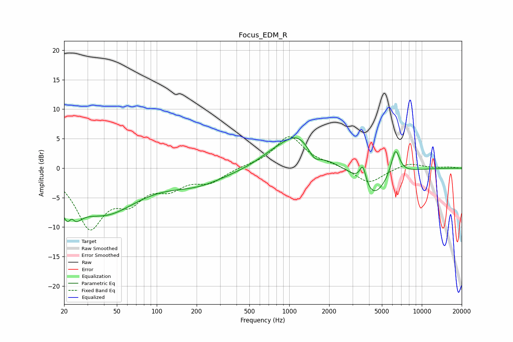

# Focus_EDM_R
See [usage instructions](https://github.com/jaakkopasanen/AutoEq#usage) for more options and info.

### Parametric EQs
Apply preamp of -5.2 dB when using parametric equalizer.

|   # | Type    |   Fc (Hz) |    Q |   Gain (dB) |
|-----|---------|-----------|------|-------------|
|   1 | Peaking |        22 | 2.66 |        -6.9 |
|   2 | Peaking |        23 | 5.72 |         3.2 |
|   3 | Peaking |        40 | 0.56 |        -7.3 |
|   4 | Peaking |       201 | 0.65 |        -2.4 |
|   5 | Peaking |       717 | 1.34 |         0.9 |
|   6 | Peaking |      1156 | 1.02 |         5.6 |
|   7 | Peaking |      1541 | 2.93 |        -2   |
|   8 | Peaking |      3589 | 5.99 |         3.2 |
|   9 | Peaking |      4312 | 1.41 |        -5   |
|  10 | Peaking |      6325 | 4.21 |         4.6 |

### Fixed Band EQs
When using fixed band (also called graphic) equalizer, apply preamp of **-5.4 dB** (if available) and set gains manually with these parameters.

|   # | Type    |   Fc (Hz) |    Q |   Gain (dB) |
|-----|---------|-----------|------|-------------|
|   1 | Peaking |        31 | 1.41 |        -9.6 |
|   2 | Peaking |        62 | 1.41 |        -4.4 |
|   3 | Peaking |       125 | 1.41 |        -2.7 |
|   4 | Peaking |       250 | 1.41 |        -2.2 |
|   5 | Peaking |       500 | 1.41 |         0.3 |
|   6 | Peaking |      1000 | 1.41 |         5.4 |
|   7 | Peaking |      2000 | 1.41 |         0.5 |
|   8 | Peaking |      4000 | 1.41 |        -2.7 |
|   9 | Peaking |      8000 | 1.41 |         0.9 |
|  10 | Peaking |     16000 | 1.41 |         0.2 |

### Graphs

