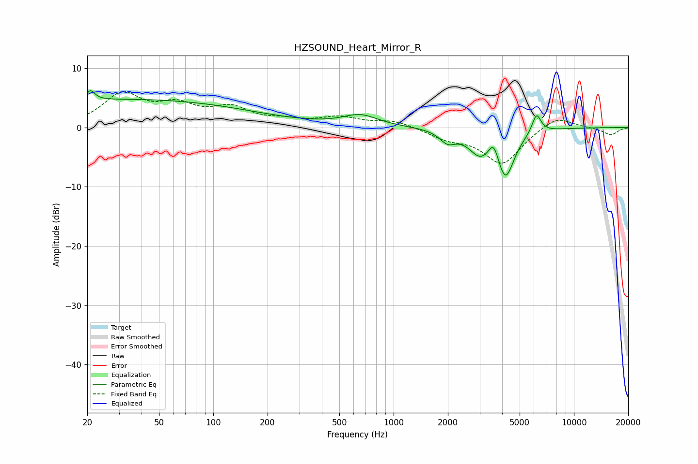

# HZSOUND_Heart_Mirror_R
See [usage instructions](https://github.com/jaakkopasanen/AutoEq#usage) for more options and info.

### Parametric EQs
Apply preamp of -6.3 dB when using parametric equalizer.

|   # | Type    |   Fc (Hz) |    Q |   Gain (dB) |
|-----|---------|-----------|------|-------------|
|   1 | Peaking |        20 | 5.82 |        -0.4 |
|   2 | Peaking |        21 | 5.98 |         2.1 |
|   3 | Peaking |        30 | 0.18 |         3.8 |
|   4 | Peaking |        51 | 0.18 |         1   |
|   5 | Peaking |       654 | 1.46 |         1.9 |
|   6 | Peaking |      1992 | 3.2  |        -1.9 |
|   7 | Peaking |      3012 | 2.22 |        -3.7 |
|   8 | Peaking |      3592 | 5.05 |         3.1 |
|   9 | Peaking |      4170 | 2.85 |        -7.9 |
|  10 | Peaking |      6202 | 5.56 |         3.3 |

### Fixed Band EQs
When using fixed band (also called graphic) equalizer, apply preamp of **-6.1 dB** (if available) and set gains manually with these parameters.

|   # | Type    |   Fc (Hz) |    Q |   Gain (dB) |
|-----|---------|-----------|------|-------------|
|   1 | Peaking |        31 | 1.41 |         5.3 |
|   2 | Peaking |        62 | 1.41 |         3.1 |
|   3 | Peaking |       125 | 1.41 |         2.9 |
|   4 | Peaking |       250 | 1.41 |         0.9 |
|   5 | Peaking |       500 | 1.41 |         1.5 |
|   6 | Peaking |      1000 | 1.41 |         1.1 |
|   7 | Peaking |      2000 | 1.41 |        -1.6 |
|   8 | Peaking |      4000 | 1.41 |        -6.1 |
|   9 | Peaking |      8000 | 1.41 |         2.2 |
|  10 | Peaking |     16000 | 1.41 |        -1.3 |

### Graphs

