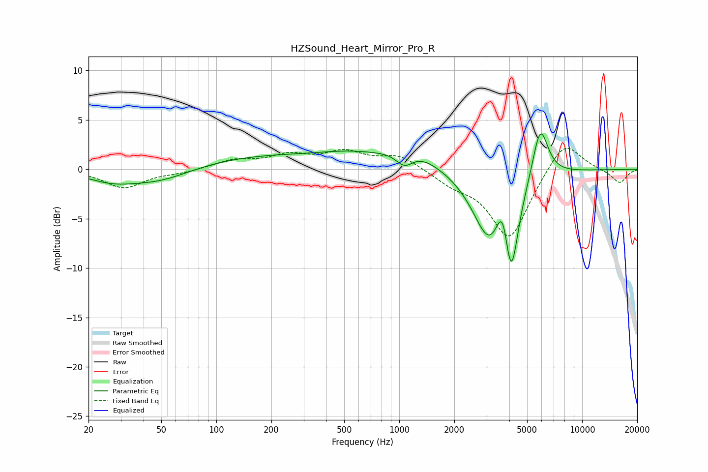

# HZSound_Heart_Mirror_Pro_R
See [usage instructions](https://github.com/jaakkopasanen/AutoEq#usage) for more options and info.

### Parametric EQs
Apply preamp of -3.7 dB when using parametric equalizer.

|   # | Type    |   Fc (Hz) |    Q |   Gain (dB) |
|-----|---------|-----------|------|-------------|
|   1 | Peaking |        27 | 1.09 |        -1   |
|   2 | Peaking |        49 | 0.78 |        -1.4 |
|   3 | Peaking |       184 | 0.33 |         1.4 |
|   4 | Peaking |       545 | 0.84 |         0.8 |
|   5 | Peaking |      1069 | 2.8  |        -1.7 |
|   6 | Peaking |      1154 | 1.05 |         2   |
|   7 | Peaking |      3130 | 1.53 |        -7   |
|   8 | Peaking |      3684 | 3.93 |         4.6 |
|   9 | Peaking |      4087 | 3.61 |        -8.8 |
|  10 | Peaking |      5902 | 3.22 |         5.5 |

### Fixed Band EQs
When using fixed band (also called graphic) equalizer, apply preamp of **-2.2 dB** (if available) and set gains manually with these parameters.

|   # | Type    |   Fc (Hz) |    Q |   Gain (dB) |
|-----|---------|-----------|------|-------------|
|   1 | Peaking |        31 | 1.41 |        -1.9 |
|   2 | Peaking |        62 | 1.41 |        -0.3 |
|   3 | Peaking |       125 | 1.41 |         0.9 |
|   4 | Peaking |       250 | 1.41 |         1.3 |
|   5 | Peaking |       500 | 1.41 |         1.6 |
|   6 | Peaking |      1000 | 1.41 |         1.4 |
|   7 | Peaking |      2000 | 1.41 |        -1.2 |
|   8 | Peaking |      4000 | 1.41 |        -7   |
|   9 | Peaking |      8000 | 1.41 |         3.2 |
|  10 | Peaking |     16000 | 1.41 |        -1.4 |

### Graphs

