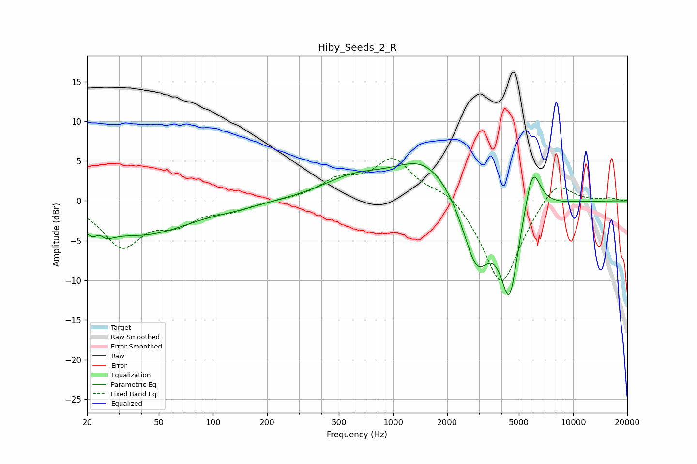

# Hiby_Seeds_2_R
See [usage instructions](https://github.com/jaakkopasanen/AutoEq#usage) for more options and info.

### Parametric EQs
Apply preamp of -4.8 dB when using parametric equalizer.

|   # | Type    |   Fc (Hz) |    Q |   Gain (dB) |
|-----|---------|-----------|------|-------------|
|   1 | Peaking |        23 | 2.65 |        -4.3 |
|   2 | Peaking |        23 | 4.54 |         2.6 |
|   3 | Peaking |        42 | 0.55 |        -4   |
|   4 | Peaking |       138 | 1.07 |        -0.4 |
|   5 | Peaking |       601 | 0.8  |         2.4 |
|   6 | Peaking |      1525 | 0.8  |         5.2 |
|   7 | Peaking |      2858 | 1.74 |        -7.2 |
|   8 | Peaking |      3010 | 2.56 |        -1.6 |
|   9 | Peaking |      4430 | 2.67 |       -11.8 |
|  10 | Peaking |      5949 | 3.06 |         6.3 |

### Fixed Band EQs
When using fixed band (also called graphic) equalizer, apply preamp of **-5.4 dB** (if available) and set gains manually with these parameters.

|   # | Type    |   Fc (Hz) |    Q |   Gain (dB) |
|-----|---------|-----------|------|-------------|
|   1 | Peaking |        31 | 1.41 |        -5.5 |
|   2 | Peaking |        62 | 1.41 |        -2.4 |
|   3 | Peaking |       125 | 1.41 |        -1.1 |
|   4 | Peaking |       250 | 1.41 |         0   |
|   5 | Peaking |       500 | 1.41 |         2.3 |
|   6 | Peaking |      1000 | 1.41 |         5   |
|   7 | Peaking |      2000 | 1.41 |         1.6 |
|   8 | Peaking |      4000 | 1.41 |       -11   |
|   9 | Peaking |      8000 | 1.41 |         3.2 |
|  10 | Peaking |     16000 | 1.41 |         0.3 |

### Graphs

