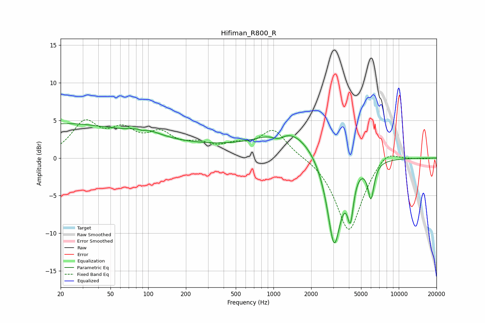

# Hifiman_R800_R
See [usage instructions](https://github.com/jaakkopasanen/AutoEq#usage) for more options and info.

### Parametric EQs
Apply preamp of -4.7 dB when using parametric equalizer.

|   # | Type    |   Fc (Hz) |    Q |   Gain (dB) |
|-----|---------|-----------|------|-------------|
|   1 | Peaking |        20 | 0.29 |         4.4 |
|   2 | Peaking |        90 | 5.94 |        -3.1 |
|   3 | Peaking |        91 | 5.81 |         2.9 |
|   4 | Peaking |        95 | 1.03 |         1.1 |
|   5 | Peaking |       215 | 0.35 |         1.4 |
|   6 | Peaking |      1095 | 2.88 |        -0.9 |
|   7 | Peaking |      1339 | 0.66 |         3.8 |
|   8 | Peaking |      3049 | 2.41 |       -12.4 |
|   9 | Peaking |      4115 | 5.9  |        -5.3 |
|  10 | Peaking |      5997 | 5.67 |        -4.6 |

### Fixed Band EQs
When using fixed band (also called graphic) equalizer, apply preamp of **-5.2 dB** (if available) and set gains manually with these parameters.

|   # | Type    |   Fc (Hz) |    Q |   Gain (dB) |
|-----|---------|-----------|------|-------------|
|   1 | Peaking |        31 | 1.41 |         4.4 |
|   2 | Peaking |        62 | 1.41 |         3   |
|   3 | Peaking |       125 | 1.41 |         2.7 |
|   4 | Peaking |       250 | 1.41 |         1.4 |
|   5 | Peaking |       500 | 1.41 |         1.3 |
|   6 | Peaking |      1000 | 1.41 |         3.7 |
|   7 | Peaking |      2000 | 1.41 |         0.2 |
|   8 | Peaking |      4000 | 1.41 |        -9.9 |
|   9 | Peaking |      8000 | 1.41 |         1.6 |
|  10 | Peaking |     16000 | 1.41 |        -0.1 |

### Graphs

