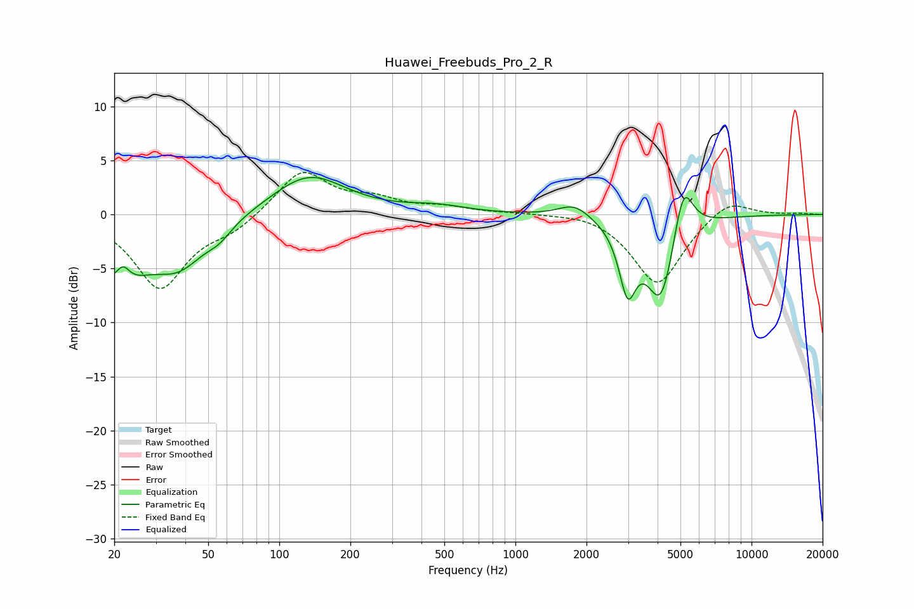

# Huawei_Freebuds_Pro_2_R
See [usage instructions](https://github.com/jaakkopasanen/AutoEq#usage) for more options and info.

### Parametric EQs
Apply preamp of -3.5 dB when using parametric equalizer.

|   # | Type    |   Fc (Hz) |    Q |   Gain (dB) |
|-----|---------|-----------|------|-------------|
|   1 | Peaking |        20 | 1.2  |        -5.8 |
|   2 | Peaking |        22 | 4.6  |         2   |
|   3 | Peaking |        38 | 1.24 |        -3.9 |
|   4 | Peaking |        56 | 2.65 |        -1   |
|   5 | Peaking |       133 | 0.91 |         3.7 |
|   6 | Peaking |       463 | 1.12 |         0.6 |
|   7 | Peaking |      1780 | 2.1  |         1.3 |
|   8 | Peaking |      2985 | 3.95 |        -5.8 |
|   9 | Peaking |      4142 | 2.18 |        -8.3 |
|  10 | Peaking |      5129 | 3.26 |         5.6 |

### Fixed Band EQs
When using fixed band (also called graphic) equalizer, apply preamp of **-4.0 dB** (if available) and set gains manually with these parameters.

|   # | Type    |   Fc (Hz) |    Q |   Gain (dB) |
|-----|---------|-----------|------|-------------|
|   1 | Peaking |        31 | 1.41 |        -6.8 |
|   2 | Peaking |        62 | 1.41 |        -1.3 |
|   3 | Peaking |       125 | 1.41 |         4.1 |
|   4 | Peaking |       250 | 1.41 |         1.2 |
|   5 | Peaking |       500 | 1.41 |         0.6 |
|   6 | Peaking |      1000 | 1.41 |         0.1 |
|   7 | Peaking |      2000 | 1.41 |         0.4 |
|   8 | Peaking |      4000 | 1.41 |        -6.6 |
|   9 | Peaking |      8000 | 1.41 |         1.7 |
|  10 | Peaking |     16000 | 1.41 |         0.1 |

### Graphs

