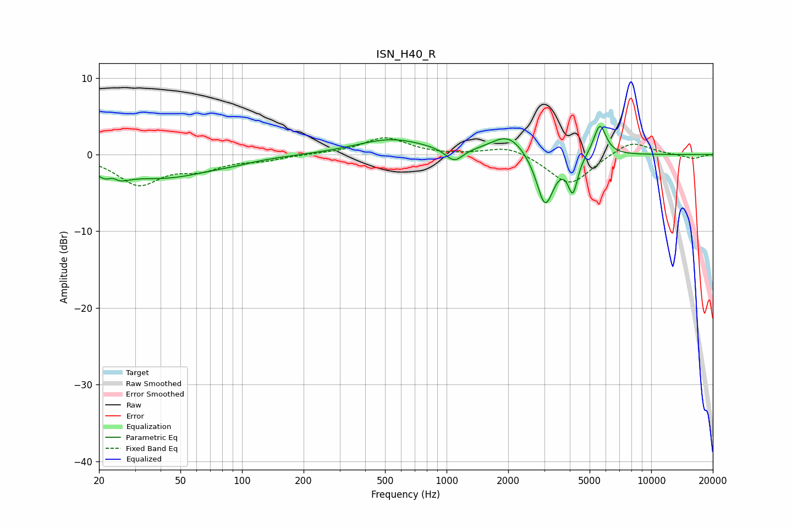

# ISN_H40_R
See [usage instructions](https://github.com/jaakkopasanen/AutoEq#usage) for more options and info.

### Parametric EQs
Apply preamp of -3.8 dB when using parametric equalizer.

|   # | Type    |   Fc (Hz) |    Q |   Gain (dB) |
|-----|---------|-----------|------|-------------|
|   1 | Peaking |        23 | 2.75 |        -3   |
|   2 | Peaking |        23 | 4.77 |         1.8 |
|   3 | Peaking |        41 | 0.58 |        -2.9 |
|   4 | Peaking |        90 | 1.71 |        -0.2 |
|   5 | Peaking |       536 | 0.82 |         2   |
|   6 | Peaking |      1089 | 3.33 |        -1.8 |
|   7 | Peaking |      2005 | 1.7  |         2.7 |
|   8 | Peaking |      3030 | 3.33 |        -7   |
|   9 | Peaking |      4141 | 6    |        -4.5 |
|  10 | Peaking |      5610 | 4.58 |         4.1 |

### Fixed Band EQs
When using fixed band (also called graphic) equalizer, apply preamp of **-2.3 dB** (if available) and set gains manually with these parameters.

|   # | Type    |   Fc (Hz) |    Q |   Gain (dB) |
|-----|---------|-----------|------|-------------|
|   1 | Peaking |        31 | 1.41 |        -3.8 |
|   2 | Peaking |        62 | 1.41 |        -1.6 |
|   3 | Peaking |       125 | 1.41 |        -0.6 |
|   4 | Peaking |       250 | 1.41 |         0.1 |
|   5 | Peaking |       500 | 1.41 |         2.2 |
|   6 | Peaking |      1000 | 1.41 |        -0.1 |
|   7 | Peaking |      2000 | 1.41 |         1.2 |
|   8 | Peaking |      4000 | 1.41 |        -4.1 |
|   9 | Peaking |      8000 | 1.41 |         1.9 |
|  10 | Peaking |     16000 | 1.41 |        -0.6 |

### Graphs

