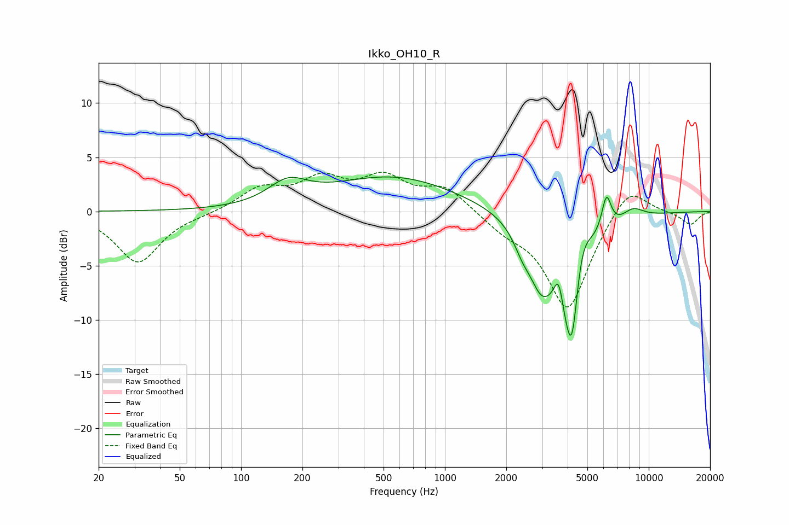

# Ikko_OH10_R
See [usage instructions](https://github.com/jaakkopasanen/AutoEq#usage) for more options and info.

### Parametric EQs
Apply preamp of -3.3 dB when using parametric equalizer.

|   # | Type    |   Fc (Hz) |    Q |   Gain (dB) |
|-----|---------|-----------|------|-------------|
|   1 | Peaking |       169 | 1.48 |         2   |
|   2 | Peaking |       561 | 0.45 |         3.2 |
|   3 | Peaking |      2393 | 3.3  |        -1.4 |
|   4 | Peaking |      2957 | 2.35 |        -4.1 |
|   5 | Peaking |      3616 | 5.97 |         3.2 |
|   6 | Peaking |      4120 | 1.86 |       -12.1 |
|   7 | Peaking |      4213 | 6    |        -3.5 |
|   8 | Peaking |      4644 | 2.8  |         5.8 |
|   9 | Peaking |      6202 | 5.81 |         3.3 |
|  10 | Peaking |      8353 | 2.47 |         1   |

### Fixed Band EQs
When using fixed band (also called graphic) equalizer, apply preamp of **-3.7 dB** (if available) and set gains manually with these parameters.

|   # | Type    |   Fc (Hz) |    Q |   Gain (dB) |
|-----|---------|-----------|------|-------------|
|   1 | Peaking |        31 | 1.41 |        -4.7 |
|   2 | Peaking |        62 | 1.41 |        -0.2 |
|   3 | Peaking |       125 | 1.41 |         2   |
|   4 | Peaking |       250 | 1.41 |         2.7 |
|   5 | Peaking |       500 | 1.41 |         2.8 |
|   6 | Peaking |      1000 | 1.41 |         2.2 |
|   7 | Peaking |      2000 | 1.41 |        -1.3 |
|   8 | Peaking |      4000 | 1.41 |        -9.1 |
|   9 | Peaking |      8000 | 1.41 |         2.8 |
|  10 | Peaking |     16000 | 1.41 |        -1.2 |

### Graphs

