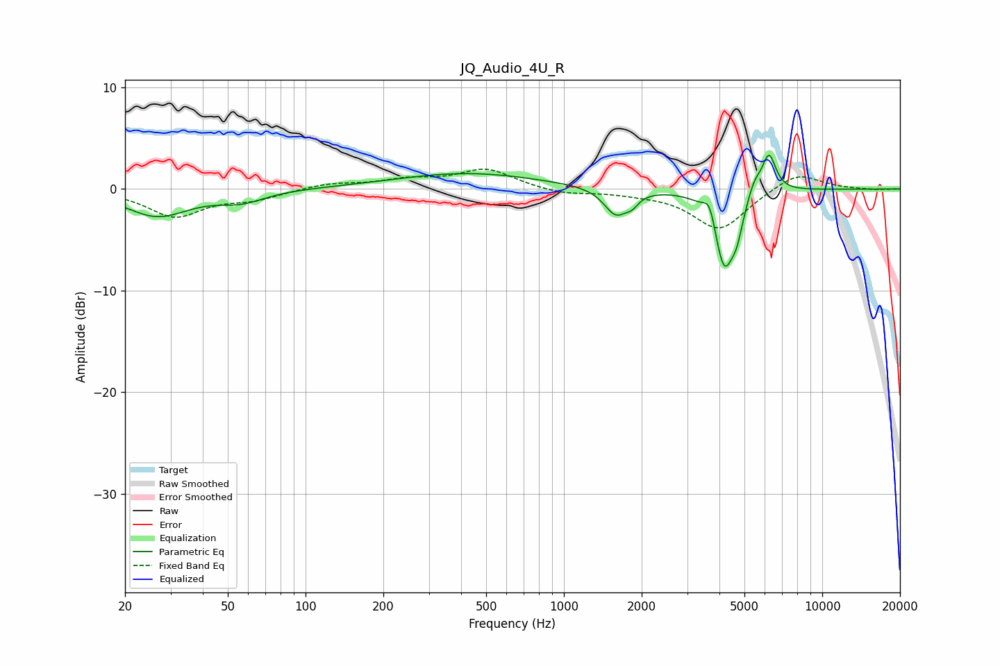

# JQ_Audio_4U_R
See [usage instructions](https://github.com/jaakkopasanen/AutoEq#usage) for more options and info.

### Parametric EQs
Apply preamp of -3.4 dB when using parametric equalizer.

|   # | Type    |   Fc (Hz) |    Q |   Gain (dB) |
|-----|---------|-----------|------|-------------|
|   1 | Peaking |        27 | 1.16 |        -2.6 |
|   2 | Peaking |        57 | 1.58 |        -1   |
|   3 | Peaking |       423 | 0.51 |         1.6 |
|   4 | Peaking |      1590 | 3.13 |        -2.6 |
|   5 | Peaking |      1838 | 5.9  |        -0.8 |
|   6 | Peaking |      3672 | 6    |         2.1 |
|   7 | Peaking |      4170 | 3.55 |        -7.7 |
|   8 | Peaking |      4674 | 6    |        -2.2 |
|   9 | Peaking |      5464 | 5.42 |         1.5 |
|  10 | Peaking |      6220 | 5.13 |         3.8 |

### Fixed Band EQs
When using fixed band (also called graphic) equalizer, apply preamp of **-2.0 dB** (if available) and set gains manually with these parameters.

|   # | Type    |   Fc (Hz) |    Q |   Gain (dB) |
|-----|---------|-----------|------|-------------|
|   1 | Peaking |        31 | 1.41 |        -2.6 |
|   2 | Peaking |        62 | 1.41 |        -0.9 |
|   3 | Peaking |       125 | 1.41 |         0.5 |
|   4 | Peaking |       250 | 1.41 |         0.8 |
|   5 | Peaking |       500 | 1.41 |         1.9 |
|   6 | Peaking |      1000 | 1.41 |        -0.5 |
|   7 | Peaking |      2000 | 1.41 |        -0.3 |
|   8 | Peaking |      4000 | 1.41 |        -4   |
|   9 | Peaking |      8000 | 1.41 |         1.8 |
|  10 | Peaking |     16000 | 1.41 |        -0.1 |

### Graphs

