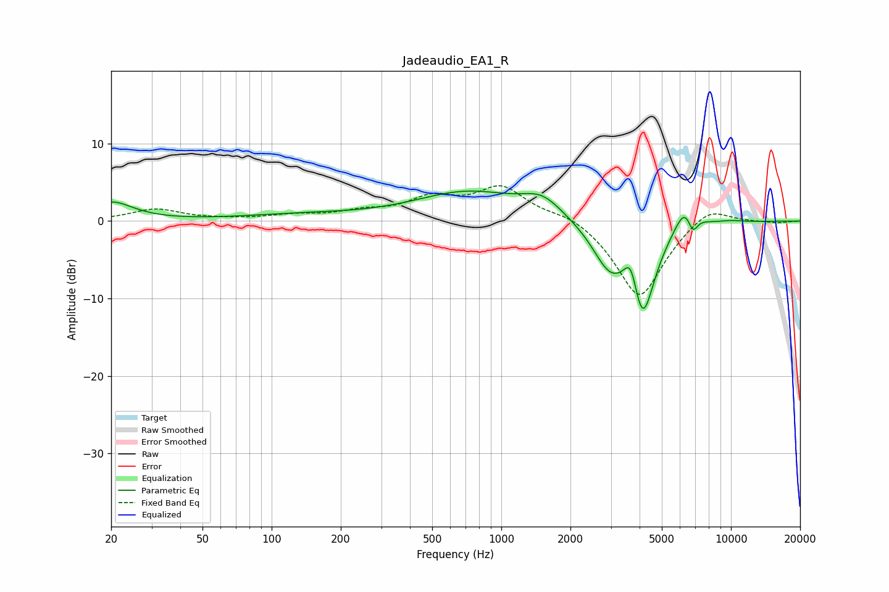

# Jadeaudio_EA1_R
See [usage instructions](https://github.com/jaakkopasanen/AutoEq#usage) for more options and info.

### Parametric EQs
Apply preamp of -4.0 dB when using parametric equalizer.

|   # | Type    |   Fc (Hz) |    Q |   Gain (dB) |
|-----|---------|-----------|------|-------------|
|   1 | Peaking |        20 | 1.51 |         2.4 |
|   2 | Peaking |       135 | 0.54 |         0.7 |
|   3 | Peaking |       716 | 0.62 |         3.6 |
|   4 | Peaking |      1507 | 1.62 |         2.4 |
|   5 | Peaking |      2953 | 1.86 |        -5.1 |
|   6 | Peaking |      3664 | 4.94 |         3.9 |
|   7 | Peaking |      4125 | 2.55 |       -11.7 |
|   8 | Peaking |      6384 | 2.89 |         3.9 |
|   9 | Peaking |      6803 | 5.97 |        -2.8 |
|  10 | Peaking |      9934 | 2.22 |         0.2 |

### Fixed Band EQs
When using fixed band (also called graphic) equalizer, apply preamp of **-4.6 dB** (if available) and set gains manually with these parameters.

|   # | Type    |   Fc (Hz) |    Q |   Gain (dB) |
|-----|---------|-----------|------|-------------|
|   1 | Peaking |        31 | 1.41 |         1.5 |
|   2 | Peaking |        62 | 1.41 |         0.1 |
|   3 | Peaking |       125 | 1.41 |         0.6 |
|   4 | Peaking |       250 | 1.41 |         1   |
|   5 | Peaking |       500 | 1.41 |         2.6 |
|   6 | Peaking |      1000 | 1.41 |         4.2 |
|   7 | Peaking |      2000 | 1.41 |         1.2 |
|   8 | Peaking |      4000 | 1.41 |       -10.2 |
|   9 | Peaking |      8000 | 1.41 |         2.4 |
|  10 | Peaking |     16000 | 1.41 |        -0.2 |

### Graphs

