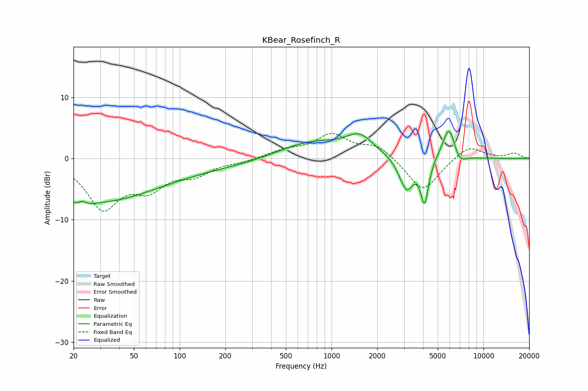

# KBear_Rosefinch_R
See [usage instructions](https://github.com/jaakkopasanen/AutoEq#usage) for more options and info.

### Parametric EQs
Apply preamp of -4.5 dB when using parametric equalizer.

|   # | Type    |   Fc (Hz) |    Q |   Gain (dB) |
|-----|---------|-----------|------|-------------|
|   1 | Peaking |        23 | 3.61 |        -4.5 |
|   2 | Peaking |        23 | 4.5  |         4.1 |
|   3 | Peaking |        29 | 0.39 |        -5.6 |
|   4 | Peaking |        76 | 0.18 |        -1.6 |
|   5 | Peaking |       729 | 0.64 |         2.8 |
|   6 | Peaking |      1533 | 1.58 |         3   |
|   7 | Peaking |      3104 | 3.01 |        -5.3 |
|   8 | Peaking |      4098 | 5.38 |        -7   |
|   9 | Peaking |      5942 | 3.21 |         5.8 |
|  10 | Peaking |      6893 | 3.27 |        -1.9 |

### Fixed Band EQs
When using fixed band (also called graphic) equalizer, apply preamp of **-4.2 dB** (if available) and set gains manually with these parameters.

|   # | Type    |   Fc (Hz) |    Q |   Gain (dB) |
|-----|---------|-----------|------|-------------|
|   1 | Peaking |        31 | 1.41 |        -7.8 |
|   2 | Peaking |        62 | 1.41 |        -4.1 |
|   3 | Peaking |       125 | 1.41 |        -2.3 |
|   4 | Peaking |       250 | 1.41 |        -0.4 |
|   5 | Peaking |       500 | 1.41 |         1.2 |
|   6 | Peaking |      1000 | 1.41 |         3.7 |
|   7 | Peaking |      2000 | 1.41 |         2.1 |
|   8 | Peaking |      4000 | 1.41 |        -5.5 |
|   9 | Peaking |      8000 | 1.41 |         2.2 |
|  10 | Peaking |     16000 | 1.41 |         0.8 |

### Graphs

