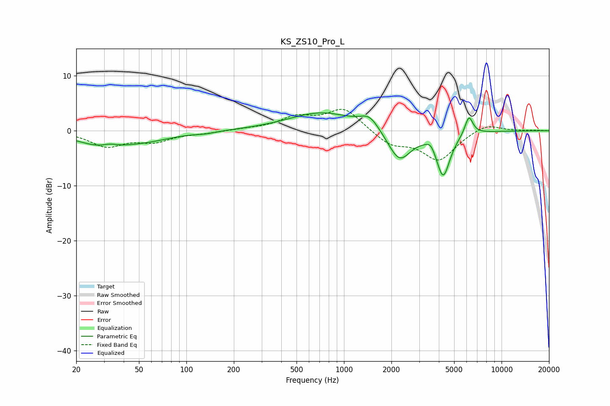

# KS_ZS10_Pro_L
See [usage instructions](https://github.com/jaakkopasanen/AutoEq#usage) for more options and info.

### Parametric EQs
Apply preamp of -3.3 dB when using parametric equalizer.

|   # | Type    |   Fc (Hz) |    Q |   Gain (dB) |
|-----|---------|-----------|------|-------------|
|   1 | Peaking |        29 | 0.89 |        -2.4 |
|   2 | Peaking |        33 | 2.99 |         0.6 |
|   3 | Peaking |        56 | 0.81 |        -1.3 |
|   4 | Peaking |       133 | 2.32 |        -0.3 |
|   5 | Peaking |       720 | 0.67 |         3.3 |
|   6 | Peaking |      1454 | 2.33 |         2.3 |
|   7 | Peaking |      2247 | 1.9  |        -5.7 |
|   8 | Peaking |      3552 | 4.89 |         1.3 |
|   9 | Peaking |      4262 | 3.2  |        -8   |
|  10 | Peaking |      6205 | 5.37 |         3.5 |

### Fixed Band EQs
When using fixed band (also called graphic) equalizer, apply preamp of **-4.0 dB** (if available) and set gains manually with these parameters.

|   # | Type    |   Fc (Hz) |    Q |   Gain (dB) |
|-----|---------|-----------|------|-------------|
|   1 | Peaking |        31 | 1.41 |        -2.7 |
|   2 | Peaking |        62 | 1.41 |        -1.7 |
|   3 | Peaking |       125 | 1.41 |        -0.4 |
|   4 | Peaking |       250 | 1.41 |         0.3 |
|   5 | Peaking |       500 | 1.41 |         2.3 |
|   6 | Peaking |      1000 | 1.41 |         4   |
|   7 | Peaking |      2000 | 1.41 |        -2.5 |
|   8 | Peaking |      4000 | 1.41 |        -5.3 |
|   9 | Peaking |      8000 | 1.41 |         1.4 |
|  10 | Peaking |     16000 | 1.41 |         0.1 |

### Graphs

