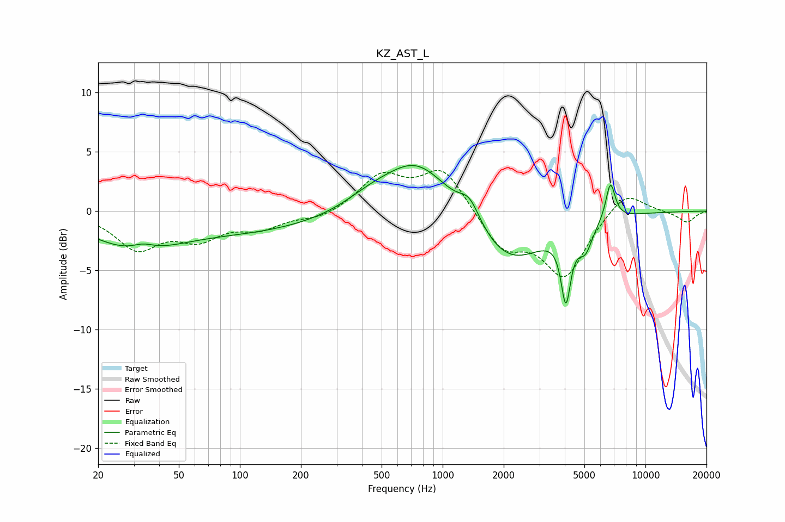

# KZ_AST_L
See [usage instructions](https://github.com/jaakkopasanen/AutoEq#usage) for more options and info.

### Parametric EQs
Apply preamp of -3.9 dB when using parametric equalizer.

|   # | Type    |   Fc (Hz) |    Q |   Gain (dB) |
|-----|---------|-----------|------|-------------|
|   1 | Peaking |        30 | 0.65 |        -2.9 |
|   2 | Peaking |        33 | 2.55 |         0.6 |
|   3 | Peaking |       123 | 0.38 |        -1.5 |
|   4 | Peaking |       435 | 1.14 |         0.8 |
|   5 | Peaking |       750 | 0.84 |         4.6 |
|   6 | Peaking |      1358 | 2.77 |         1.9 |
|   7 | Peaking |      2119 | 0.79 |        -4.6 |
|   8 | Peaking |      4052 | 6    |        -5.7 |
|   9 | Peaking |      5049 | 3.9  |        -2.1 |
|  10 | Peaking |      6721 | 5.9  |         3.2 |

### Fixed Band EQs
When using fixed band (also called graphic) equalizer, apply preamp of **-3.5 dB** (if available) and set gains manually with these parameters.

|   # | Type    |   Fc (Hz) |    Q |   Gain (dB) |
|-----|---------|-----------|------|-------------|
|   1 | Peaking |        31 | 1.41 |        -3   |
|   2 | Peaking |        62 | 1.41 |        -2   |
|   3 | Peaking |       125 | 1.41 |        -1.3 |
|   4 | Peaking |       250 | 1.41 |        -0.7 |
|   5 | Peaking |       500 | 1.41 |         2.9 |
|   6 | Peaking |      1000 | 1.41 |         3.6 |
|   7 | Peaking |      2000 | 1.41 |        -3.1 |
|   8 | Peaking |      4000 | 1.41 |        -5.4 |
|   9 | Peaking |      8000 | 1.41 |         1.9 |
|  10 | Peaking |     16000 | 1.41 |        -1   |

### Graphs

