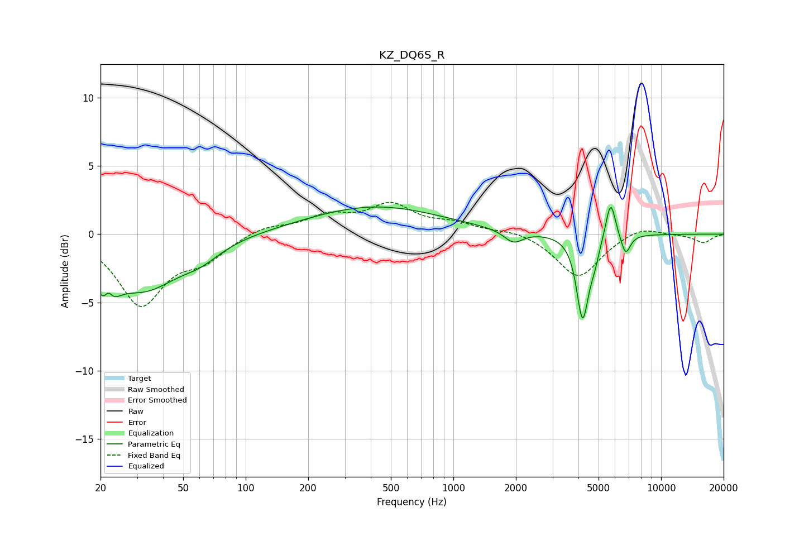

# KZ_DQ6S_R
See [usage instructions](https://github.com/jaakkopasanen/AutoEq#usage) for more options and info.

### Parametric EQs
Apply preamp of -2.1 dB when using parametric equalizer.

|   # | Type    |   Fc (Hz) |    Q |   Gain (dB) |
|-----|---------|-----------|------|-------------|
|   1 | Peaking |        21 | 3.61 |        -4.1 |
|   2 | Peaking |        22 | 6    |         2.5 |
|   3 | Peaking |        32 | 0.82 |        -3.8 |
|   4 | Peaking |        61 | 1.48 |        -0.9 |
|   5 | Peaking |       419 | 0.44 |         2   |
|   6 | Peaking |      1947 | 3.14 |        -0.9 |
|   7 | Peaking |      4189 | 4.9  |        -6   |
|   8 | Peaking |      4769 | 5.74 |        -1.1 |
|   9 | Peaking |      5716 | 5.99 |         2.9 |
|  10 | Peaking |      6751 | 6    |        -1.5 |

### Fixed Band EQs
When using fixed band (also called graphic) equalizer, apply preamp of **-2.4 dB** (if available) and set gains manually with these parameters.

|   # | Type    |   Fc (Hz) |    Q |   Gain (dB) |
|-----|---------|-----------|------|-------------|
|   1 | Peaking |        31 | 1.41 |        -5   |
|   2 | Peaking |        62 | 1.41 |        -1.6 |
|   3 | Peaking |       125 | 1.41 |         0.6 |
|   4 | Peaking |       250 | 1.41 |         1.2 |
|   5 | Peaking |       500 | 1.41 |         2   |
|   6 | Peaking |      1000 | 1.41 |         0.7 |
|   7 | Peaking |      2000 | 1.41 |         0.3 |
|   8 | Peaking |      4000 | 1.41 |        -3.2 |
|   9 | Peaking |      8000 | 1.41 |         0.7 |
|  10 | Peaking |     16000 | 1.41 |        -0.6 |

### Graphs

